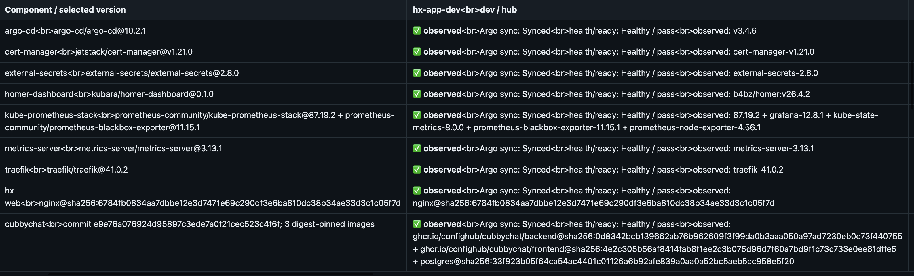
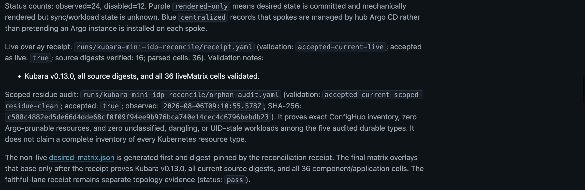
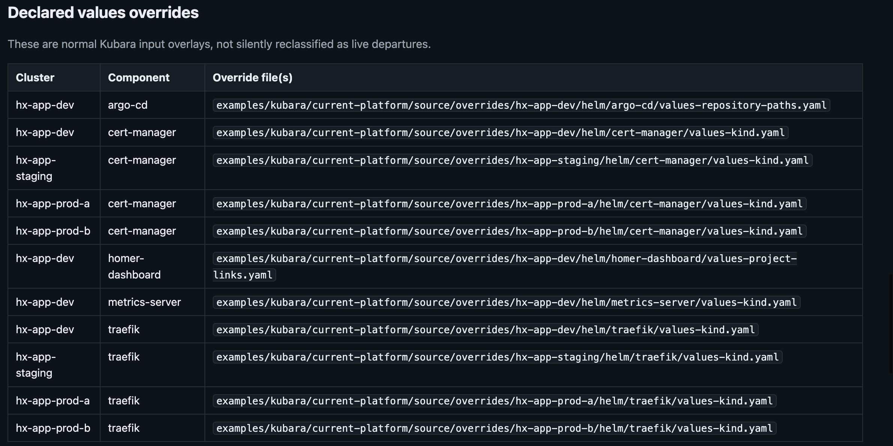

# Kubara on ConfigHub

This repository shows how a [Kubara](https://github.com/kubara-io)-generated platform runs through [ConfigHub](https://confighub.com): the native config stays the input, every generated file is imported at an exact Git revision, and delivery becomes governed releases with receipts you can verify.

Kubara keeps what it is good at. It selects components from its catalogs, wires a hub and spokes, and generates the platform files. ConfigHub adds what teams ask for next: component identity with retained versions, approvals before production, exact-digest releases, one-target rollback, drift repair, a fleet matrix, and queryable wiring. Argo CD remains the cluster reconciler on every target.

## See the result first

One application, four clusters, every placement healthy at its exact retained release. Production B stays on the older release because production A was rolled back one target at a time:


The same application's production history shows the full governed story in one view: retained release tags, promotions, the one-target rollback, approval gates, and the applied head release:


The fleet matrix keeps desired placement separate from observed release, sync, health, and readiness. Here is its development column, every component observed, Synced, and Healthy at its exact version or digest:



Beneath the matrix, the live overlay receipt and the scoped residue audit tie the page to committed evidence — all 36 cells validated, zero audited residue, the audit's own SHA-256 in the page:



Values overrides stay declared Kubara inputs, listed per cluster and component, never silently reclassified as live departures:



These details are cut from one receipt-bound frame, [the full matrix page](docs/images/kubara/06-fleet-matrix-clean-inventory.png). The [GUI tour](docs/demo/kubara/gui-tour.md) walks all six frames with their key takeaways.

## Two paths from here

### View the platform

Read the [GUI tour](docs/demo/kubara/gui-tour.md) to see the running integration frame by frame, then the [six-step tutorial](docs/demo/kubara/adoption.md) as the story of how it was built. The [checkpoints ledger](docs/demo/kubara/checkpoints.md) records what is machine-proven and what remains gated.

### Build your own platform

Start on your laptop. Clone this repository and run one command; it needs Node.js and nothing else — no cluster, no registry, no ConfigHub account:

```sh
npm run kubara-adoption:self-test
```

This rehearses the whole journey on your machine: reading the Kubara config, compiling the generated platform into packages, importing them, and handing off application releases. It runs against built-in stand-ins for Git, the OCI registry, and ConfigHub, so nothing external is touched. Four "self-test passed" lines mean the exact tooling you would later run for real works end to end, including refusing bad input.

When you are ready to build for real, you need [Kubara](https://github.com/kubara-io) if you want to generate your own platform rather than reuse the committed example, the [cub CLI](https://docs.confighub.com) logged into your own ConfigHub organization, and clusters (kind works; the reference fleet is kind). Your platform code lives wherever your Git lives: fork this repository, or start a fresh one and copy [examples/kubara/git-import/](examples/kubara/git-import/) as your request templates.

Then work through the six steps in order. Steps 1 to 4 are fully offline; step 5 is your first live contact, and step 6 hands off applications:

1. [Choose the platform in native Kubara config](docs/demo/kubara/adoption-1-choose.md)
2. [Run Kubara and verify the generated platform](docs/demo/kubara/adoption-2-generate.md)
3. [Commit the exact hand-off to Git](docs/demo/kubara/adoption-3-git.md)
4. [Compile per-component OCI packages and the digest index](docs/demo/kubara/adoption-4-oci.md)
5. [Import into a selected ConfigHub organization](docs/demo/kubara/adoption-5-confighub-org.md)
6. [Add, promote, approve, and roll back applications](docs/demo/kubara/adoption-6-apps.md)

The honest status: every step has deterministic self-tests that pass, the complete journey has passed live against the reference organization below, and the general fresh-organization path has not yet passed its complete live acceptance run. That distinction stays visible in the [checkpoints ledger](docs/demo/kubara/checkpoints.md) until it is earned.

## The reference deployment behind these pages

Everything you see here comes from one live reference integration that we operate:

- A ConfigHub organization named **Kubara** on hub.confighub.com holding 55 Spaces, 63 managed Units, and 25 curated NeedsProvides Links.
- Four kind clusters (`hx-app-dev`, `hx-app-staging`, `hx-app-prod-a`, `hx-app-prod-b`) forming the hub-and-spoke fleet, each running its own Argo CD.
- The platform components Kubara selected (cert-manager, traefik, external-secrets, kube-prometheus-stack, metrics-server, homer-dashboard) plus two example applications.

You do not need access to that organization. Every claim these pages make about it is bound by SHA-256 to a committed receipt in [runs/](runs/) and [data/](data/), every screenshot binds the same source commit as the receipts, and the verifiers below let you check the chain yourself.

## How applications work

Applications ride the same delivery path as platform components. The reviewed application source lives in a base Space (`hx-web-base`, `hx-cubbychat-base`). A variant Space per cluster binds it to that cluster's target. Publishing creates an immutable release; the reconciler submits only the exact release `ManifestDigest` to Argo with a Kubernetes compare-and-set, so a mutable `latest` pointer can never bypass review. Production Spaces carry approval gates; promotion moves the exact reviewed revision downstream; rollback restores one target to an exact earlier release while its peer keeps the newer one; a reviewed per-target departure (a staging-only environment variable) survives later promotions. Chapter 6 of the tutorial runs this end to end.

## Check that we are not making this up

A screenshot of a healthy dashboard proves nothing about the system that produced it. So every screenshot and measured number on these pages ships with a receipt: a YAML file committed in this repository that records where it came from — the exact Git commit, the ConfigHub organization, the capture time — plus a SHA-256 fingerprint of every file involved.

These commands recompute the fingerprints and compare them against the receipts. They fail loudly if any image, page, or number was edited after the evidence was recorded:

```sh
npm run kubara-mini-idp:receipt-verify
npm run kubara-mini-idp:performance:receipt-verify
npm run kubara-mini-idp:orphan-audit:receipt-verify
npm run kubara-platform-matrix:verify
npm run kubara-wiring:verify
```

When evidence is missing or stale, the pages say so themselves instead of showing a green badge. A screenshot never replaces a machine checkpoint.

## Where your Helm charts come from

If you build your own platform, your charts keep coming from Kubara's own catalogs, exactly as they do today. Your `config.yaml` names them (`oci://ghcr.io/kubara-io/catalogs/bootstrap`, `oci://ghcr.io/kubara-io/catalogs/general`), Kubara resolves components from them, and ConfigHub imports what Kubara generated. Nothing in this repository substitutes chart sources or sits between you and the Kubara catalogs.

Separately, our test lab [confighub/helm-expt](https://github.com/confighub/helm-expt) maintains its own Helm chart catalog that we used to cross-check Kubara's rendered output byte for byte. That catalog stayed in helm-expt, and it is the instrument we would pick up again to rebuild this platform at a newer Kubara release and cross-check the regenerated output the same way. A few deep generated evidence views under `data/kubara-catalog-release/recipe-views/` link into it; no tutorial step depends on them. This project moved here from [confighub/helm-expt](https://github.com/confighub/helm-expt) at commit `6b4bc9d6b`, and the receipts committed here chain back to that public history, so a rebuild can prove exactly what changed since this snapshot.
