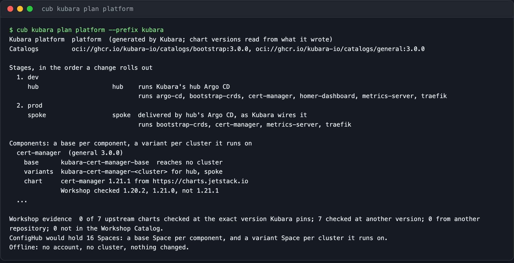
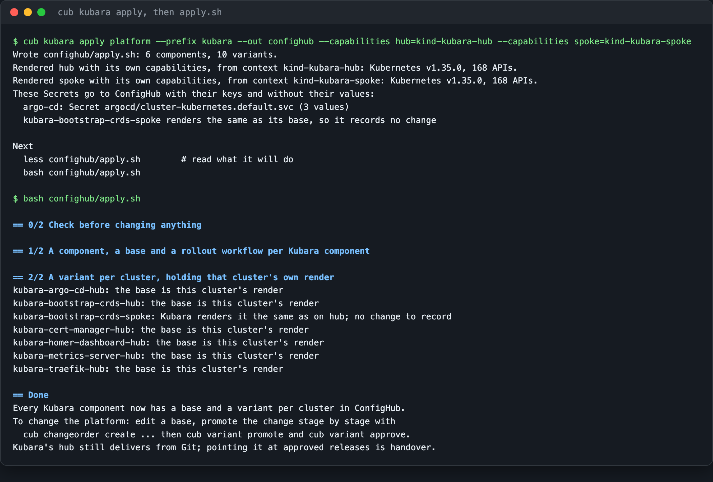
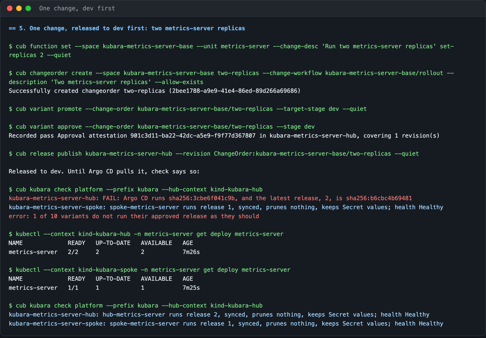
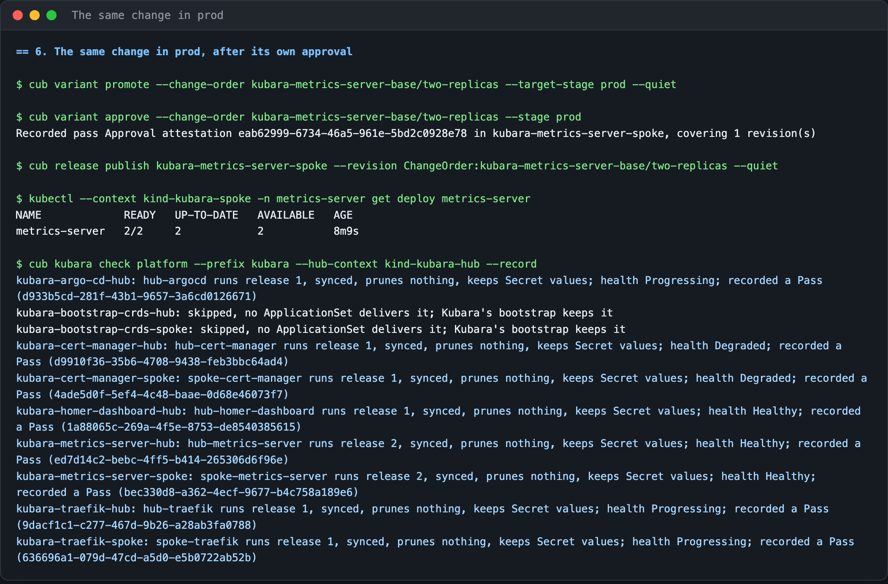
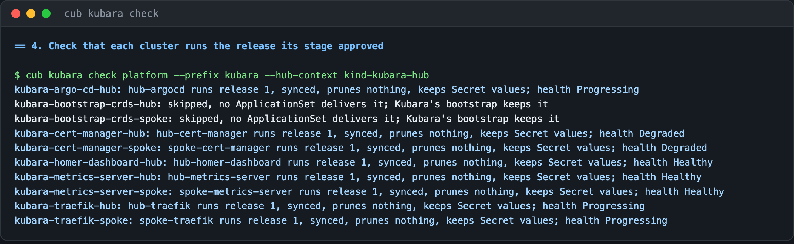
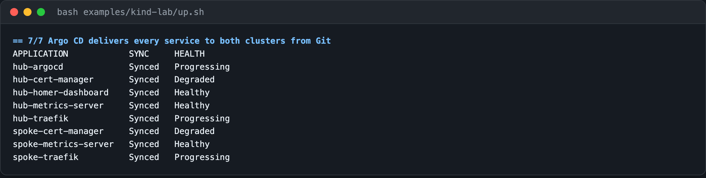

# Kubara on ConfigHub

Run your platform with [Kubara](https://kubara.io), and approve every change
to it in [ConfigHub](https://confighub.com). Each cluster runs only the release
its stage approved, and you can see who approved it.

Kubara stays exactly as it is. It still generates the platform from your
`config.yaml`, and its hub's Argo CD still delivers every service through its
ApplicationSets. ConfigHub decides what each cluster should run.

This repository has three things:
- **the plugin, `cub kubara`**, which brings a Kubara platform into ConfigHub
  and hands its hub over;
- **a lab you can run on your laptop**, a Kubara hub and spoke on kind;
- **the earlier reference platform**, kept in [Before cub kubara](docs/before-cub-kubara.md).

## How it fits together


- **Kubara generates the platform.** You describe clusters and services in
  `config.yaml`, and `kubara generate` writes the charts and each cluster's
  values, as it always has.
- **ConfigHub holds what each cluster runs.** Each Kubara component gets a
  **base**, and each cluster that runs it gets a **variant**. A variant holds
  the exact Kubernetes objects Kubara's hub would deliver to that cluster.
- **You change the base once.** The change reaches each cluster stage by
  stage, in the order of the stages in your `config.yaml`, with an approval in
  each stage.
- **Kubara's hub delivers.** After handover, each ApplicationSet reads the
  cluster's approved release from ConfigHub instead of Git. The hub, its
  AppProject and its sync settings stay.

## What it answers

| You want to | What you do | Section |
| --- | --- | --- |
| See what ConfigHub would hold, before you have an account | `cub kubara plan` reads your Kubara platform offline | [1](#1-see-what-confighub-will-hold) |
| Start a new Kubara platform with checked components | `cub kubara services`, then `cub kubara init` | [2](#2-start-a-new-kubara-platform) |
| Keep what Kubara generated, as reviewable objects per cluster | `cub kubara apply` renders each cluster the way Kubara's hub delivers it | [3](#3-put-the-platform-into-confighub) |
| Make each cluster run only what its stage approved | `cub kubara handover` points Kubara's ApplicationSets at approved releases | [4](#4-hand-kubaras-hub-to-confighub) |
| Roll a change out dev before prod | Change the base once, then promote, approve and publish stage by stage | [5](#5-roll-a-change-out-dev-before-prod) |
| Know that each cluster runs what was approved | `cub kubara check` compares what Argo CD synced with what ConfigHub released | [6](#6-check-that-each-cluster-runs-what-was-approved) |
| See what each cluster runs, and who changed it | ConfigHub keeps every revision with its author, reason and approvals | [7](#7-see-what-each-cluster-runs-and-who-changed-it) |
| Keep Secret values on your clusters | Secrets reach ConfigHub as keys only, and Argo CD leaves live values alone | [8](#8-keep-secret-values-on-your-clusters) |
| Let an AI assistant make changes safely | Every step is a `cub` command, and people approve each stage | [9](#9-work-with-an-ai-assistant) |
| Check the platform before anything runs, or put apps on it | Use the Kubara platform as a ConfigHub Workshop stack | [10](#10-use-your-kubara-platform-as-a-stack) |

## The plugin: `cub kubara`

```bash
cub plugin install confighub/kubara-confighub
```

| Command | What it does |
| --- | --- |
| `cub kubara services` | Lists Kubara's catalog services, with the ConfigHub Workshop's evidence for each chart. **Offline.** |
| `cub kubara init` | Writes a Kubara `config.yaml` for a new platform, for `kubara generate`. **Offline.** |
| `cub kubara plan` | Shows what ConfigHub would hold for a platform Kubara generated. **Changes nothing**, and needs no account or cluster. |
| `cub kubara apply` | Renders each cluster the way Kubara's hub delivers it, and writes `apply.sh` for you to read and then run. |
| `cub kubara handover` | Writes `handover.sh`, which releases each variant and points Kubara's ApplicationSets at the approved releases. It stops if Argo CD would delete anything. |
| `cub kubara check` | Checks that each cluster runs the release its stage approved, and can record the result in ConfigHub. |
| `cub kubara version` | Prints the version. See [what's new](docs/whats-new.md). |

After handover you don't need the plugin day to day. Changes are made with
ConfigHub's own `cub` commands, shown below.

You need the `cub` CLI (`cub auth login`), `helm`, Kubara v0.15 or newer, and
`kubectl` access to Kubara's hub. Kubara's hub needs Argo CD 3.1 or newer,
which Kubara ships.

## What you can do with it

The examples below come from the [kind lab](examples/kind-lab/README.md): a hub
called `hub` in stage `dev`, and a spoke called `spoke` in stage `prod`. Each
screen is from its [recorded run](examples/kind-lab/run-2026-09-28.log), which
has the same output as text.

### 1. See what ConfigHub will hold

Point `plan` at a platform Kubara has generated. It needs no account, and it
changes nothing:

```bash
cub kubara plan my-platform
```



The stages come from the `stage` you gave each cluster in Kubara. Where the
[ConfigHub Workshop Catalog](https://confighub.github.io/helm-expt/site/) has
checked the exact chart version Kubara pins, the plan links to what it
installs and needs. Where it hasn't, the plan says which versions it did
check. Kubara's catalogs stay the source of every component, and the plan
never swaps a version.

### 2. Start a new Kubara platform

List what Kubara's catalog offers, with the Workshop's evidence, then write a
`config.yaml` for Kubara to generate:

```bash
cub kubara services
cub kubara init --out my-platform --hub hub:dev --spoke spoke:prod \
  --services cert-manager,metrics-server,traefik \
  --repository https://github.com/acme/platform.git
cp my-platform/.env.example my-platform/.env     # then fill it in
kubara --work-dir my-platform --config-file config.yaml --env-file .env generate --helm
```

`init` writes Kubara's own `config.yaml` and nothing else Kubara needs. From
here the platform is an ordinary Kubara platform.

### 3. Put the platform into ConfigHub

`apply` renders each cluster the way Kubara's hub delivers it: the same
release name, namespace and values order as Kubara's ApplicationSets. With
`--capabilities`, it also uses each real cluster's Kubernetes version and APIs,
as Argo CD does. Then read the script it writes, and run it:

```bash
cub kubara apply my-platform --out my-platform-confighub \
  --capabilities hub=<hub context> --capabilities spoke=<spoke context>
less my-platform-confighub/apply.sh
bash my-platform-confighub/apply.sh
```



`apply.sh` creates a base and a rollout workflow per component, and a variant
per cluster. It changes nothing on your clusters, and it is safe to run again.
Kubara's hub keeps delivering from Git until the handover.

### 4. Hand Kubara's hub to ConfigHub

```bash
cub kubara handover my-platform --out my-platform-confighub --capabilities hub=<hub context>
HUB_CONTEXT=<hub context> bash my-platform-confighub/handover.sh
```


`handover.sh` gives each cluster a Target, and releases every variant an
ApplicationSet delivers, through its rollout workflow, stage by stage. Then it
changes the hub, and it checks first. For each Application, it compares what
Argo CD manages today with the release it is about to read, and stops if Argo
CD would delete anything. Then it points each ApplicationSet at the cluster's
approved release in ConfigHub, and waits until every Application reads it.


Nothing is reinstalled. On the kind lab, every Application synced from
ConfigHub, nothing was pruned, no workload restarted, and every Secret kept
its value. The [guide](docs/user/cub-kubara.md#hand-the-hub-to-confighub)
explains each step.

### 5. Roll a change out, dev before prod

Make the change once, on the base. Here, two replicas for metrics-server:

```bash
cub function set --space kubara-metrics-server-base --unit metrics-server \
  --change-desc "Run two metrics-server replicas" set-replicas 2
cub changeorder create --space kubara-metrics-server-base two-replicas \
  --change-workflow kubara-metrics-server-base/rollout --description "Two metrics-server replicas"
```

Then take it through the stages. In each stage you promote, approve and
publish:

```bash
cub variant promote --change-order kubara-metrics-server-base/two-replicas --target-stage dev
cub variant approve --change-order kubara-metrics-server-base/two-replicas --stage dev
cub release publish kubara-metrics-server-hub --revision ChangeOrder:kubara-metrics-server-base/two-replicas
```

Kubara's hub delivers it to the hub cluster. The spoke keeps one replica until
the change is promoted, approved and published in prod as well.



Then the same three commands for prod:



### 6. Check that each cluster runs what was approved

```bash
cub kubara check my-platform --hub-context <hub context>
```



`check` compares the digest Argo CD synced with the digest of the release
ConfigHub published. It also checks that Argo CD would delete nothing, and
that a sync leaves live Secret values alone. Health is shown and not judged,
because it depends on the cluster as much as on the release. Straight after a
release, before Argo CD has pulled it, `check` says so:

```text
kubara-metrics-server-hub: FAIL: Argo CD runs sha256:3cbe6f041c9b, and the latest release, 2, is sha256:b6cbc4b69481
```

With `--record`, `check` writes each result into the variant's Space as an
attestation, next to its approvals.

### 7. See what each cluster runs, and who changed it

```bash
cub space list --where "Slug LIKE 'kubara-%-spoke'"                    # everything on the spoke
cub unit data --space kubara-metrics-server-spoke metrics-server        # the exact objects it runs
cub revision list --space kubara-metrics-server-spoke metrics-server    # every change, with who and why
cub changeorder get --space kubara-metrics-server-base two-replicas     # where a rollout has got to
cub kubara check my-platform --hub-context <hub context>                # whether each cluster runs it
```

Each change carries its author and a reason. Each stage's approval is
recorded against the exact revisions it covers.

### 8. Keep Secret values on your clusters

Kubara's charts render Secrets, and some of them hold generated values.
ConfigHub holds each Secret with its keys and without its values. At handover,
each ApplicationSet tells Argo CD to leave Secret data alone, so live values
survive every sync and every later release. A cluster that joins later gets
its Secrets without values, for your secret store to fill.

One rule follows. If you sync by hand, keep `RespectIgnoreDifferences` on, as
Kubara's own sync options do. A sync without it empties those values.

### 9. Work with an AI assistant

Every step is a `cub` or `kubectl` command, so an assistant in your terminal
can do the work:

| You ask | It runs |
| --- | --- |
| "What would ConfigHub hold for my Kubara platform?" | `cub kubara plan …` |
| "Put it into ConfigHub" | `cub kubara apply …`, then shows you `apply.sh` to read before it runs |
| "Two metrics-server replicas, dev first" | `cub function set …`, `cub changeorder create …`, `cub variant promote …` |
| "Is every cluster running what we approved?" | `cub kubara check …` |

**Approval stays with people.** Each stage's release waits for
`cub variant approve`, and ConfigHub refuses a stage out of order.

### 10. Use your Kubara platform as a stack

`cub kubara` is for running a Kubara platform. The
[ConfigHub Workshop](https://confighub.github.io/helm-expt/site/) does a
different job. `cub stack from-kubara` turns a Kubara platform into a Workshop
stack. You can then check that it holds together before anything runs, put
apps on it, or publish it as OCI for a cluster Kubara doesn't manage.

## Try it on your laptop

The [kind lab](examples/kind-lab/README.md) builds a Kubara hub and spoke on
kind, generated and bootstrapped by Kubara itself, with the hub's Argo CD
delivering from a Git server inside the hub. Then it runs every step above
against your ConfigHub organization, and takes one change to dev and then prod.

```bash
bash examples/kind-lab/up.sh     # the Kubara platform, about 10 minutes
cub auth login
bash examples/kind-lab/run.sh    # the cub kubara story, about 6 minutes
bash examples/kind-lab/down.sh   # remove it
```

After `up.sh`, Kubara's hub delivers every service to both clusters from Git,
before ConfigHub is involved:



Its [recorded run](examples/kind-lab/run-2026-09-28.log) shows every command
and what it printed. The plugin's tests run offline with `go test ./...`.

## Documentation

- [The cub kubara guide](docs/user/cub-kubara.md): every command, from plan to
  handover to check, and what each one changes.
- [The kind lab](examples/kind-lab/README.md): the whole story on your laptop.
- [What's new](docs/whats-new.md): what each release changed.
- [The first live run](examples/cub-kubara/lab-handover-2026-09-28.log): the
  run that proved handover, with the four faults it found and how each was
  fixed.
- [Before cub kubara](docs/before-cub-kubara.md): the earlier reference
  platform, which adapted Kubara, with its evidence chain.

## Status

`cub kubara` is tested on kind with Kubara v0.15.0, the 3.0.0 catalogs and
Argo CD 3.5.2. It has not run on a production platform yet, and not yet with
Kubara v0.16. We would like to hear from anyone who runs Kubara about what it
gets wrong about their platform.
