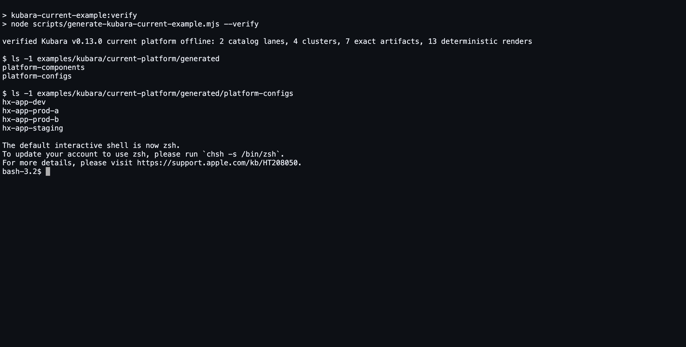

# Step 2: let Kubara generate the complete platform

This is the second of six adoption steps. Kubara now turns the reviewed
selection into its familiar generated platform tree.

## Goal

Run the normal Kubara generation path, preserve its platform components,
platform configurations, add-ons, AppProjects, ApplicationSets, overrides, and
cluster wiring, and bind the result to exact, reproducible evidence.

For the current example, the same config is generated twice: once from a
pinned snapshot of Kubara's official 1.1.0 catalogs and once from the
byte-preserving ConfigHub-aligned export. Both runs must produce exactly the
same 135 paths and bytes.

## What remains Kubara

- The executable is Kubara v0.13.0.
- Kubara reads its native `config.yaml`, catalogs, service definitions, and
  values configuration.
- Kubara's ordinary `generate --helm` path creates `platform-components/` and
  `platform-configs/`.
- The generated AppProjects and ApplicationSets preserve the recognizable hub
  and spoke topology.
- A Kubara user can inspect, diff, and operate the generated tree with Kubara's
  existing documentation and mental model.

ConfigHub does not emulate Kubara generation, infer missing intent, or rewrite
the result into a different source model.

## What ConfigHub adds

The reproducibility wrapper around generation adds:

- a SHA-pinned Kubara binary and exact Helm build;
- immutable catalog snapshots and a byte-preserving aligned export;
- exact chart archive checksums and the Traefik OCI manifest digest;
- path-and-byte comparison of the two catalog lanes;
- deterministic double rendering for every selected component instance;
- a checksum inventory and machine-readable receipts; and
- checks that reject workstation paths, credential-shaped material, unresolved
  placeholders, missing repository authorization, and unrecorded overrides.

These are supply-chain and review controls around Kubara's output. The
generation receipt explicitly records live reconciliation as unobserved.

## Reproduce the current example

Generation is the only online phase in these first two steps. It requires
Kubara, Helm, `curl`, `oras`, and network access to the exact reviewed artifact
locations.

### 1. Verify the aligned catalog export

```sh
cd /absolute/path/to/helm-expt
npm run kubara-catalog-adapter:verify
```

This must pass before the aligned catalog can participate in the comparison.
It proves the export matches the pinned Kubara catalog tree; it does not prove
the generated result until the next command succeeds.

### 2. Install and verify the pinned Kubara binary

Download Kubara v0.13.0 for your platform from the release identified in
[`source-lock.yaml`](../../../examples/kubara/current-platform/source-lock.yaml).
Verify both the release archive and extracted binary against that lock. For the
recorded Darwin arm64 example, the extracted binary SHA-256 is
`72642ce49aa5e9d13aeb4441aebc4c4530c7427c0d0aacbcee7b97e249f57183`.

```sh
export KUBARA_BIN=/absolute/path/to/kubara
"$KUBARA_BIN" --version
shasum -a 256 "$KUBARA_BIN"
```

The expected version output is `kubara version v0.13.0`. Use the checksum for
your reviewed release asset and platform; never copy the Darwin arm64 checksum
onto a different binary.

### 3. Generate both catalog lanes and all effective renders

```sh
npm run kubara-current-example:generate
```

The generator internally invokes Kubara's familiar command against a clean
temporary work directory:

```text
kubara --work-dir <temporary-lane> \
  --config-file config.yaml \
  --env-file .env \
  generate --helm
```

The temporary `.env` is generation-only and is never copied to the result. The
generator then places the reviewed normal overrides beside Kubara's
`values.generated.yaml`, fetches only the exact locked component archives, and
renders each selected instance twice with the same capabilities.

Do not run the illustrative command by hand and expect it to reproduce this
repository's evidence: the wrapper also performs the catalog substitution in
temporary copies, exact artifact checks, double rendering, and atomic output
replacement.

### 4. Verify without network or clusters

```sh
npm run kubara-current-example:verify
```

Verification does not require Kubara, Helm, registries, chart repositories, a
ConfigHub organization, or a Kubernetes cluster. It recomputes the source,
generated-tree, render, and receipt checks from committed bytes.

## Expected artifacts

After a successful current-example generation, review:

```text
examples/kubara/current-platform/
  generated/
    platform-components/
    platform-configs/
  effective-renders/<cluster>/<service>/release-objects.yaml
  source-checksums.txt
  generated-checksums.txt
  effective-render-checksums.txt
  catalog-parity-receipt.yaml
  generation-receipt.yaml
```

The expected current counts are:

- 135 files in `generated/`;
- 13 `release-objects.yaml` effective renders;
- two catalog lanes with no path or byte differences;
- four clusters; and
- seven exact external artifact locks, plus the retained first-party Kubara
  wrappers.

The effective renders are desired-state evidence. They are not evidence that
Argo CD applied the objects or that the workloads became healthy.

## Machine checkpoint

Run the verifier, then independently count the two principal output sets:

```sh
npm run kubara-current-example:verify

test "$(find examples/kubara/current-platform/generated -type f | wc -l | tr -d ' ')" = 135
test "$(find examples/kubara/current-platform/effective-renders \
  -name release-objects.yaml -type f | wc -l | tr -d ' ')" = 13
```

The verifier's final line must be:

```text
verified Kubara v0.13.0 current platform offline: 2 catalog lanes, 4 clusters, 7 exact artifacts, 13 deterministic renders
```

Then inspect
[`catalog-parity-receipt.yaml`](../../../examples/kubara/current-platform/catalog-parity-receipt.yaml).
Its `status.result` must be `pass`, `comparison.mode` must be
`path-and-byte-for-byte`, `fileCount` must be 135, and `differences` must be an
empty list.

That is the evidence for “adopt without a rewrite.” It does not establish live
ConfigHub, Argo, or Kubernetes health; those checkpoints occur in Steps 5 and
6.

## Screenshot checkpoint

Do not substitute a diagram or mocked terminal for the machine result. This
chapter owns exactly one future adoption frame, separate from the ConfigHub
GUI tour.

<!-- kubara-adoption-screenshot step="2" id="generation-parity" path="../../images/kubara-adoption/02-kubara-generation-parity.png" -->



After the checkpoint and complete source-current live gate pass, capture one
real terminal/repository frame containing the complete verifier final line and
the adjacent generated tree with `platform-components/`,
`platform-configs/`, and the four cluster directories visible. This may be a
single real browser or terminal workspace view; do not assemble unrelated
runs into a synthetic image.

The caption should say: **“Kubara's official catalog and the ConfigHub-aligned
export generated 135 path-and-byte-identical files.”** Include the commit ID in
the surrounding page text, not as an unverifiable graphic annotation. A live
ConfigHub or cluster screenshot does not belong at this step. Embed the image
at the declared path only when the six-frame adoption receipt binds its digest
and UTC capture time to the same source commit and Git trees, generation and
catalog-parity receipts, visible identities, sensitive-value handling,
caption, and claim boundary. Until then, leave the hook unexpanded.

## Troubleshooting

### The Kubara binary version or SHA differs

Stop and resolve the source lock. Do not regenerate receipts with an
unreviewed binary. If intentionally upgrading Kubara, review and update the
source lock, regenerate both lanes, and treat any output difference as a real
platform change.

### An exact chart is unavailable from a mutable Helm index

Use the exact reviewed release URL or OCI reference recorded in
`component-artifacts.yaml`, and verify its checksum or manifest digest. Never
silently select the nearest version. Add the newly obtained artifact to the
Catalog without removing older retained versions.

### The two catalog lanes differ

Inspect `Catalog.yaml`, `services/`, `platform-components/`, and
`platform-configs/` in the aligned export. A ConfigHub component mapping may
add metadata outside that export, but the compatibility export must preserve
Kubara's full package. Do not waive a byte difference.

### Rendering is nondeterministic

Find the time-, randomness-, network-, or environment-dependent template input
and make it explicit. Do not keep the first render and discard the second.

### A rendered result contains a credential or workstation path

Move secrets and target-local facts out of the portable platform tree. Replace
imperative local changes with reviewed `values-*.yaml` overrides where the
setting is genuinely part of desired configuration.

### Only the raw Kubara tree exists

That is still a valid Kubara result, but it is not yet the complete ConfigHub
handoff. Generate the exact locks, deterministic renders, checksums, and
receipts before continuing.

## Safe to stop here

Yes. A passing generated tree is a complete Kubara result and deterministic
evidence, but it has not yet crossed the Git, OCI, ConfigHub, or live-cluster
boundaries. Preserve the source locks and receipts with the output.

## Continue

[← Step 1: choose components and wiring](adoption-1-choose.md) · [Step 3: commit and push the complete hand-off →](adoption-3-git.md)
