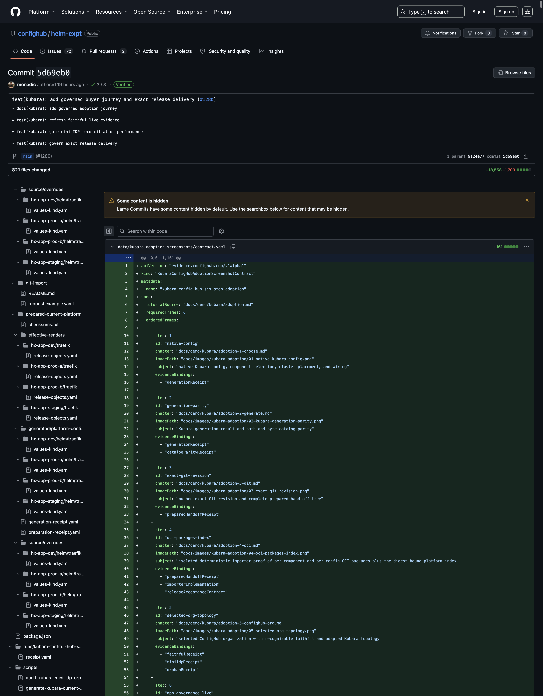

# Step 3: commit and push the complete hand-off to Git

This is the third of six adoption steps. Git becomes the immutable, portable
boundary between Kubara composition and ConfigHub import.

## Goal

Prepare, review, commit, push, and independently verify one complete Kubara
platform hand-off. The next step must receive an exact Git object ID and a
fully inventoried selected path—not a mutable branch, a workstation directory,
or an AI-produced translation.

“Complete” means every artifact needed to reproduce and understand the
portable platform. It does not mean committing credentials, application
secrets, or destination-specific cluster facts.

## What remains Kubara

- Git retains Kubara's native `config.yaml` and supported values overrides.
- Git retains Kubara's complete generated `platform-components/` and
  `platform-configs/` trees, including AppProjects and ApplicationSets.
- Existing faithful-mode Git and Argo workflows can continue to review and
  reconcile the generated paths.
- The Git revision remains a portable exit and re-import point. ConfigHub does
  not become the only copy of the platform definition.

The preparer consumes Kubara's result; it never runs or emulates Kubara.

## What ConfigHub adds

The deterministic hand-off adds a separate, clean subtree containing:

- the selected Kubara source and documented overrides;
- the generated component and configuration trees;
- exact Kubara, Helm, catalog, chart, and dependency locks;
- 13 deterministic effective renders;
- source/render checksums and generation/preparation receipts; and
- an offline provides/needs wiring graph.

The preparer inventories all named inputs before promotion and atomically
replaces only its configured output path. It refuses overlapping paths,
symlinks, pre-vendored opaque chart archives, ambiguous component matches,
unreviewed exact versions, workstation paths, credential-shaped material, and
input changes during preparation.

It does not create a ConfigHub organization, inspect a cluster, package OCI,
or prove live reconciliation. Those boundaries remain explicit in later
steps.

## Prepare the current example

### 1. Start from the generated, verified platform

```sh
cd /absolute/path/to/helm-expt
npm run kubara-current-example:verify
git status --short
```

Review any existing changes before continuing. A dirty working tree is not
automatically disposable, and the preparer must not be used to overwrite
unrelated work.

### 2. Review the preparation request

Open
[`current-platform.prepare.yaml`](../../../examples/kubara/git-import/current-platform.prepare.yaml).
For this example it maps:

```text
source config       examples/kubara/current-platform/source/config.yaml
generated wrappers  examples/kubara/current-platform/generated/platform-components/helm
generated configs   examples/kubara/current-platform/generated/platform-configs
artifact lock       examples/kubara/current-platform/component-artifacts.yaml
source lock         examples/kubara/current-platform/source-lock.yaml
normal overrides    examples/kubara/current-platform/source/overrides
clean output        examples/kubara/prepared-current-platform
```

For an existing Kubara repository, copy this request and change only reviewed
paths and contracts. `source.path` may name the root of a dedicated Kubara
checkout; `output.path` must be a separate, non-overlapping subtree.

### 3. Generate the clean hand-off

Use the same SHA-pinned Kubara binary reviewed in Step 2:

```sh
export KUBARA_BIN=/absolute/path/to/kubara
npm run kubara-git-handoff:prepare-current
```

This is the network/write phase. The preparer fetches only the exact reviewed
artifacts, renders each enabled instance twice with the pinned profile, builds
the wiring graph, scans structure for credential-shaped material, and promotes
the output atomically.

### 4. Review the prepared subtree before committing

`--generate` verifies the staged preparation before its atomic promotion. Now
review the promoted files and its machine-produced evidence:

```sh
git diff --stat -- examples/kubara/prepared-current-platform
sed -n '1,45p' \
  examples/kubara/prepared-current-platform/preparation-receipt.yaml
tail -n 8 \
  examples/kubara/prepared-current-platform/preparation-receipt.yaml
```

The receipt must name four clusters and 13 renders, and its status must record
`result: "pass"`, `deterministic: true`, and `pathNeutral: true`. Do not run
`kubara-git-handoff:verify-current` yet: its zero-write contract intentionally
requires the preparation request, raw inputs, and prepared output to be
committed and clean. That independent verification occurs after the commit.

### 5. Review what will and will not be committed

Commit these groups together:

- `examples/kubara/current-platform/source/`;
- `examples/kubara/current-platform/generated/`;
- the source lock, component-artifact lock, checksums, and generation/parity
  receipts;
- `examples/kubara/git-import/current-platform.prepare.yaml`; and
- the complete `examples/kubara/prepared-current-platform/` subtree.

The portable hand-off deliberately excludes:

- `apps/**`—applications enter through the separate Step 6 workflow;
- `target-facts/**` and destination binding facts;
- `.env` and `.env.*` files;
- credentials, private keys, secret values, and cluster access material; and
- the external scanner's report, which is retained in controlled evidence and
  referenced by digest rather than embedded in the portable tree.

Inspect the exact staged diff before committing:

```sh
git add -- \
  examples/kubara/current-platform/source \
  examples/kubara/current-platform/generated \
  examples/kubara/current-platform/effective-renders \
  examples/kubara/current-platform/source-lock.yaml \
  examples/kubara/current-platform/component-artifacts.yaml \
  examples/kubara/current-platform/source-checksums.txt \
  examples/kubara/current-platform/generated-checksums.txt \
  examples/kubara/current-platform/effective-render-checksums.txt \
  examples/kubara/current-platform/catalog-parity-receipt.yaml \
  examples/kubara/current-platform/generation-receipt.yaml \
  examples/kubara/git-import/current-platform.prepare.yaml \
  examples/kubara/prepared-current-platform

git diff --cached --check
git diff --cached --stat
git status --short
```

If your repository uses different paths, stage the corresponding reviewed
inputs and outputs explicitly. Do not use a broad staging command as a
substitute for reviewing the boundary.

### 6. Commit and push the exact revision

```sh
git commit -m "Add prepared Kubara platform hand-off"
git push --set-upstream origin HEAD

git rev-parse HEAD
test "$(git rev-parse HEAD)" = "$(git rev-parse '@{upstream}')"
```

Record the full lowercase commit object ID printed by `git rev-parse HEAD`.
The Step 4 import request must use that immutable object ID and the selected
prepared path; it must not use `main`, another branch, or a tag as its source
identity.

### 7. Verify from a separate clean checkout

```sh
git clone https://github.com/confighub/helm-expt.git /absolute/path/to/clean-checkout
cd /absolute/path/to/clean-checkout
git checkout --detach <full-commit-object-id>

git status --porcelain
npm run kubara-git-handoff:verify-current
git status --porcelain
```

Both `git status --porcelain` commands must produce no output. For an adopter's
repository, substitute its reviewed HTTPS `.git` remote and its preparation
request.

Run the approved, pinned external secret scanner against this exact detached
commit and selected path. Retain the scanner report outside the Git tree, bind
its bytes and scope in the later import request, and separately review opaque
files. The built-in structural scan and the external scan are defenses, not a
mathematical proof that arbitrary bytes contain no secret.

## Expected artifacts

The current clean hand-off is
[`examples/kubara/prepared-current-platform`](../../../examples/kubara/prepared-current-platform/).
Its top level contains:

```text
source/config.yaml and reviewed overrides
generated/platform-components/helm/
generated/platform-configs/
effective-renders/<cluster>/<service>/release-objects.yaml
component-artifacts.yaml
source-lock.yaml
generation-receipt.yaml
preparation-request.yaml
preparation-receipt.yaml
checksums.txt
wiring/graph.json
```

In the current committed tree, `checksums.txt` inventories 166 other files;
together with `checksums.txt` itself, the selected hand-off contains 167
files. The authoritative statement is the recomputed verifier and receipt, not
a count copied into prose: if an intentional input changes, regenerate the
subtree and update the documentation from the accepted evidence.

The preparation receipt currently records `finalGitCommitBound: false` because
preparation necessarily happens before the resulting commit exists. Step 4
binds the pushed source commit, selected path, external-scan attestation, and
destination separately.

## Machine checkpoint

From the detached clean checkout, run the independent offline verifier:

```sh
test -z "$(git status --porcelain)"
npm run kubara-git-handoff:verify-current
test -z "$(git status --porcelain)"

test "$(wc -l < examples/kubara/prepared-current-platform/checksums.txt | tr -d ' ')" = 166
test "$(find examples/kubara/prepared-current-platform -type f | wc -l | tr -d ' ')" = 167
```

The verifier must pass and both clean-tree checks must remain silent. The count
checks document the current example; the verifier is the substantive gate.

This checkpoint proves a deterministic, clean, pushed platform hand-off. It
does not prove OCI publication, ConfigHub materialization, Argo sync, workload
health, exact governed inventory, or a residue-free live organization.

## Screenshot checkpoint

No GitHub screenshot is embedded until the exact revision is public, the
checkpoint above passes, and the complete source-current live gate passes.
This chapter owns exactly one future adoption frame, separate from the
ConfigHub GUI tour.

<!-- kubara-adoption-screenshot step="3" id="exact-git-revision" path="../../images/kubara-adoption/03-exact-git-revision.png" -->



Capture one real GitHub commit view that shows:

1. the full commit ID;
2. the source, generated, and prepared paths in the same change;
3. the preparation receipt and checksum inventory; and
4. the passing repository check associated with that commit.

The caption should say: **“The exact Git revision is the portable Kubara
hand-off; ConfigHub imports these reviewed bytes without an AI rewrite.”** Do
not expose scanner findings, credentials, signed URLs, tokens, or private
repository details in the screenshot. Embed it at the declared path only when
the six-frame adoption receipt binds the commit, repository tree, selected
prepared-subtree tree, preparation receipt, image digest, UTC capture time,
visible identities, sensitive-value handling, caption, and claim boundary.
Until then, leave the hook unexpanded.

## Troubleshooting

### The preparation output overlaps an input

Choose a separate clean output subtree. The preparer intentionally refuses to
rearrange or overwrite Kubara's native source and generated tree.

### The preparer finds credential-shaped material

Remove the value from the portable path and provide it later through the
selected target's secret-management boundary. Never suppress the refusal by
renaming a secret-shaped file.

### The verifier reports copied-input drift

An input changed after preparation. Review the change, rerun Kubara if needed,
regenerate the hand-off, and verify again. Do not patch the prepared copy.

### The checkout is dirty before or after verification

Start from the exact pushed commit in a separate checkout. Untracked files and
generated residue are import refusals because they make the source boundary
ambiguous.

### The pushed branch and local commit differ

Do not continue with a branch name. Resolve the push, fetch the remote, and
confirm the exact local commit equals its upstream. Then pin the full object ID
in the import request.

### The Git remote is mutable or ambiguous

Use the reviewed HTTPS remote ending in `.git` and a full immutable commit
object ID. The importer should refuse mutable refs, a wrong origin, or a
selected byte changing during compilation.

### An external secret scan passes

Passing is necessary but not sufficient. Retain the exact scanner name and
version, digest the report outside the tree, bind it to the commit and selected
scope, and explicitly review opaque files before marking that review complete.

## Safe to stop here

Yes. The exact pushed Git revision is the portable hand-off and can be reviewed
independently before any OCI publication or ConfigHub mutation. Retain the scan
attestation outside the tree and do not replace the commit with a moving ref.

## Continue

[← Step 2: let Kubara generate the platform](adoption-2-generate.md) · [Step 4: import the Git revision and publish OCI →](adoption-4-oci.md)
