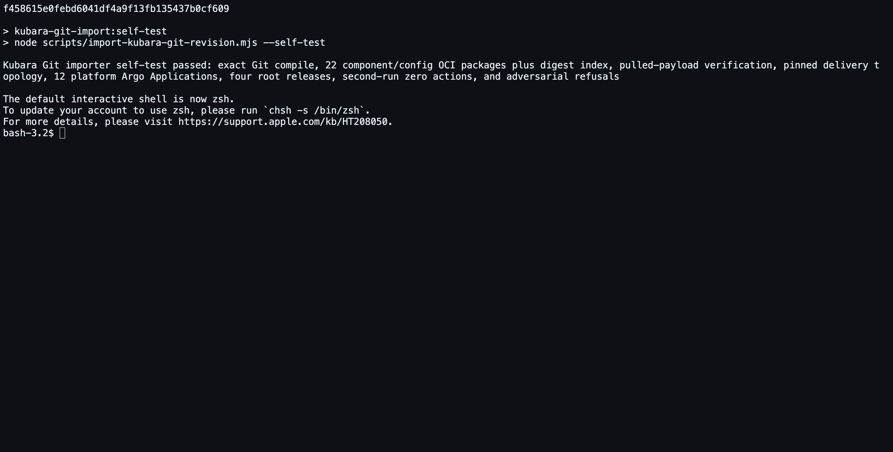

# Step 4: Turn the exact Kubara Git revision into immutable OCI

## Your goal

Take the exact reviewed Git revision from Step 3, verify that it is the Kubara
platform you approved, and publish it as a digest-bound OCI set that ConfigHub
can materialize in Step 5.

The result is deliberately not one giant platform artifact. It contains one
target-neutral package per reusable component definition, one target-neutral
package per effective component/configuration set, and one platform index that
references their exact manifest and layer digests. Destination bindings,
cluster facts, and secrets are not placed in those portable packages.

## What stays Kubara

- The input is still Kubara's committed `config.yaml`, generated component and
  cluster trees, ordinary overrides, locks, renders, and wiring facts.
- The Git commit remains the portable, independently reviewable hand-off.
- Kubara remains the composer. The importer consumes Kubara's result; it does
  not regenerate it, reinterpret it with AI, or replace it with a new schema.
- Application source is still separate from the platform hand-off and enters
  the journey in Step 6.

## What ConfigHub adds

- Exact-source and complete-scope verification before packaging.
- Component-first packages whose retained versions can be governed separately
  from one platform selection.
- Content-addressed OCI publication with exact remote manifest and layer
  verification.
- A target-neutral `PlatformDigest` for the portable platform and a separate
  `BindingDigest` for the selected ConfigHub destination.
- Refusal of dirty, mutable, ambiguous, mismatched, credential-shaped, or
  concurrently changed inputs.

The implementation is deterministic code. AI is not part of the required
import path.

## Before you start

Complete Steps 1–3 and have all of the following:

- a clean detached checkout at the full pushed Git object ID;
- the prepared platform subtree bound by its
  [`preparation-receipt.yaml`](../../../examples/kubara/prepared-current-platform/preparation-receipt.yaml)
  and [`checksums.txt`](../../../examples/kubara/prepared-current-platform/checksums.txt);
- a passing external secret-scan report stored outside that checkout;
- a reviewed copy of
  [`portable-request.example.yaml`](../../../examples/kubara/git-import/portable-request.example.yaml)
  whose source commit, selected path, layout, scan attestation, and untagged
  OCI repository base are exact; and
- `oras` authenticated to that repository base.

No ConfigHub organization, context, Space, Target, runtime observation,
target fact, or secret is required for this step. Portable compile and
publication now happen before the user chooses a ConfigHub destination. The
organization and each cluster-local Argo runtime are selected, inspected, and
bound explicitly in Step 5.

The exact importer contract and full field reference live in
[`examples/kubara/git-import/README.md`](../../../examples/kubara/git-import/README.md).
Start from
[`portable-request.example.yaml`](../../../examples/kubara/git-import/portable-request.example.yaml),
but never use its example hash, repository, commit, path, or OCI base as real
authority. Step 5 starts separately from `request.example.yaml` when a
destination is selected.

Run the repository commands below from the `helm-expt` repository root.

For the commands below, substitute your controlled paths:

```bash
export KUBARA_CHECKOUT=/absolute/path/to/clean-detached-checkout
export KUBARA_PORTABLE_REQUEST=/controlled/import/portable-request.yaml
export KUBARA_PORTABLE=/controlled/import/portable
mkdir -p "$KUBARA_PORTABLE"
```

Do not put the controlled import directory inside the Git checkout.

## 4.1 Review the target-neutral request

The portable request is intentionally small. Confirm that it contains only:

- the immutable repository URL, full Git object ID, and selected path;
- the supported Kubara layout beneath that path;
- the exact scanner name/version, report SHA-256, source commit, scope path,
  and explicit opaque-file review; and
- an untagged `publication.catalogOCIBase`.

Do not copy destination slugs, UUIDs, ConfigHub context, runtime observations,
target facts, tokens, or secret values into this request. Those facts belong
to the separate destination request and binding created in Step 5.

## 4.2 Compile, inspect, and reproduce the portable package set

Compile outside the checkout, then regenerate and compare every portable
semantic output byte:

```bash
node scripts/import-kubara-git-revision.mjs --compile-portable \
  --request "$KUBARA_PORTABLE_REQUEST" \
  --checkout "$KUBARA_CHECKOUT" \
  --output "$KUBARA_PORTABLE"

node scripts/import-kubara-git-revision.mjs --verify-portable \
  --request "$KUBARA_PORTABLE_REQUEST" \
  --checkout "$KUBARA_CHECKOUT" \
  --output "$KUBARA_PORTABLE"
```

Review `platform-lock.yaml`, `portable-package-set.json`, the local payloads,
and `portable-checksums.txt`. The portable directory must not contain
`destination-binding-lock.yaml` or `target-facts-required.yaml`. A changed Git
object, selected byte, request field, or generated output causes verification
to fail.

## 4.3 Publish and verify the immutable OCI set

Hold exclusive single-writer control of the reviewed OCI repository base for
the complete publication operation, then run:

```bash
node scripts/import-kubara-git-revision.mjs --package-portable \
  --request "$KUBARA_PORTABLE_REQUEST" \
  --checkout "$KUBARA_CHECKOUT" \
  --output "$KUBARA_PORTABLE"
```

The importer inspects, publishes, and post-inspects every remote artifact. A
pre-existing content-addressed reference is reused only when its artifact type,
media type, layer count, digest, and size all match. A conflict is refused.
No ConfigHub or cluster mutation occurs.

## 4.4 Keep the portable result independent of its destination

At this checkpoint the exact Git revision and portable OCI set can be carried
to a ConfigHub organization selected later. Step 5 performs a separate
read-only `--inspect-destination`, then `--bind` proves that recompiling the
same Git source produces byte-for-byte identical portable members and the same
`PlatformDigest`. The binding writes a different `BindingDigest` for the
selected organization and explicitly keeps it outside OCI.

This split is the adoption promise made executable: Kubara's Git result stays
portable; OCI is its immutable delivery form; ConfigHub destination authority
is added without recompiling the platform for one organization.

## Expected artifacts

The controlled output contains:

| Path | Meaning |
| --- | --- |
| `platform-lock.yaml` | Exact source/content/materialization lock and target-neutral `PlatformDigest`. |
| `portable-package-set.json` | Ordered component-definition, effective-config, and platform-index package contract. |
| `portable-checksums.txt` | Exact hashes of all portable semantic outputs. |
| `payloads/*.json` | Deterministic target-neutral member bytes produced by portable compile and covered by `portable-checksums.txt`. |
| `oci/payloads/*.json` | Local publication copies of the member bytes plus the final digest-bound platform index. |
| `oci-publication-receipt.json` | Exact remote refs, manifest digests, layer digests, roles, and publication result. |

The destination-bound `import-plan.json`, `destination-binding-lock.yaml`,
`target-facts-required.yaml`, `acceptance.json`, `checksums.txt`, and
`portable-binding-receipt.json` do not exist until Step 5 runs `--bind` into a
separate output directory.

For the committed four-cluster fixture, the isolated acceptance suite produces
22 component/config packages plus one digest index. That number describes the
fixture, not a required count for every Kubara platform.

## Machine checkpoint

Anyone can exercise the complete importer contract without a live
organization, registry, or cluster:

```bash
npm run kubara-git-import:self-test
```

Expected final line:

```text
Kubara Git importer self-test passed: exact Git compile, 22 component/config OCI packages plus digest index, pulled-payload verification, pinned delivery topology, 12 platform Argo Applications, four root releases, second-run zero actions, and adversarial refusals
```

This is **current deterministic, isolated evidence**. The self-test uses fake
Git, OCI, and ConfigHub surfaces. It proves the importer contract and its
refusals; it does not prove that your selected live organization has been
changed or that any cluster is healthy.

For a real publication, also require
`oci-publication-receipt.json.status.result` to equal `pass`, confirm that
`targetFactsIncluded` is `false`, and retain the receipt with the reviewed
portable request and Git object ID.

## Screenshot to capture after the checkpoint passes

Do not manufacture a registry screenshot for the isolated self-test. This
chapter owns exactly one future adoption frame, separate from the ConfigHub
GUI tour.

<!-- kubara-adoption-screenshot step="4" id="oci-packages-index" path="../../images/kubara-adoption/04-oci-packages-index.png" -->



After the isolated self-test checkpoint and the complete source-current
documentation gate pass, capture one real terminal/workspace frame from that
same self-test run. It must show the complete passing final line, including
the reported 22 component/config OCI packages, digest index, pulled-payload
verification, pinned delivery topology, zero-action second run, and refusal
cases. The caption must name the Git commit and say explicitly that these are
deterministic **fake Git, OCI, and ConfigHub test surfaces**. This frame proves
the importer contract and isolated package/index behavior; it does not claim a
live registry publication, ConfigHub materialization, or cluster health.

Embed it at the declared path only when the six-frame adoption receipt binds
the exact source commit and Git trees, prepared hand-off receipt, importer
implementation, release-acceptance contract, image digest, UTC capture time,
visible package/index identities, sensitive-value handling, caption, and
claim boundary. It must not be presented as the real-publication receipt
described above. Until then, leave the hook unexpanded.

## Troubleshooting

| Symptom | What it means | Safe response |
| --- | --- | --- |
| Compile rejects a branch, dirty checkout, untracked file, or changed byte | The input is not the exact Git hand-off from Step 3. | Create a clean detached checkout at the pushed object ID. Do not bypass the check. |
| The credential scan or structural scan fails | The selected tree is unsafe or its attestation does not bind this exact commit and scope. | Remove the material from the portable tree, rescan the final commit, and update the portable request with the exact attestation. |
| Verification says an output is stale | The request, Git bytes, or compiled output changed after compilation. | Use a fresh output directory and recompile from the exact reviewed inputs. |
| OCI publication observes a different existing layer | Another writer or prior incompatible publication owns that reference. | Keep the conflicting evidence, stop publication, and resolve repository ownership. Never overwrite it. |
| The portable directory contains destination or target-fact files | Portable and destination-bound outputs were mixed. | Stop and compile into a new empty portable directory outside the checkout. Never publish the mixed directory. |
| The self-test passes but the live registry is empty | The self-test is intentionally isolated. | Run the real `--package-portable` command with authenticated `oras` and inspect its publication receipt. |

## Safe to stop

It is safe to stop after portable compile/verify or package. None of those
operations mutates ConfigHub or a cluster. OCI publication is additive and
content-addressed; retain the output and receipt if it completed.

Do not begin Step 5 unless the portable compiler outputs still verify and the
exact OCI receipt passes. Step 5 creates the destination binding and its
pending target-fact template. If any portable input changed, create a new
controlled portable output directory rather than rewriting evidence for the
prior revision.

Previous: [Step 3 — commit and push the complete hand-off](adoption-3-git.md)

Next: [Step 5 — materialize the platform in the selected ConfigHub organization](adoption-5-confighub-org.md)
