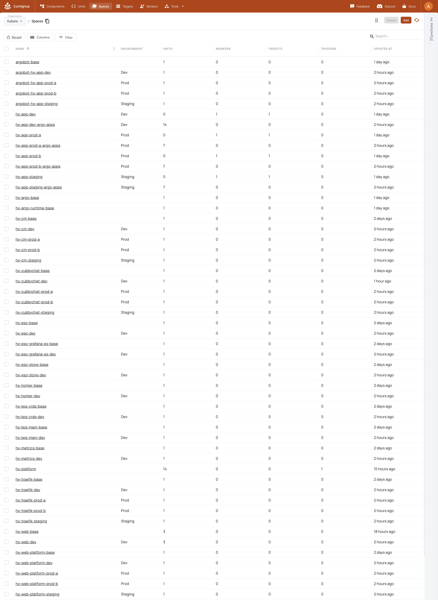

# Step 5: Materialize the platform in the organization you selected

## Your goal

Load the exact OCI set from Step 4 into an explicitly selected ConfigHub
organization, preserving the recognizable Kubara platform and delivery shape
while adding governed definitions, instances, releases, lineage, and wiring.

The successful checkpoint is not “objects appear in the GUI.” It is an exact
apply receipt followed by a second zero-action run. For the complete example,
that receipt must be followed by a separate cluster-convergence check and a
scoped residue audit.

## What stays Kubara

- Kubara's selected components, versions, per-cluster specializations,
  generated namespaces, and dependency order remain the desired platform.
- Kubara's hub/ApplicationSet/AppProject topology remains available as the
  separately proved **faithful** lane.
- Argo CD remains the cluster reconciler in the ConfigHub-adapted lane; each
  cluster keeps a small local reconciler that applies the exact digest
  authorized by ConfigHub.
- Git remains the exact source hand-off and the OCI members remain the
  immutable delivery form.

## What ConfigHub adds

- A component-first view over retained definitions and exact versions.
- Separate definition and target-instance Spaces rather than one flattened
  platform object.
- Immutable releases and exact `UpgradeUnit` lineage.
- Curated native `NeedsProvides` Links for operational wiring.
- Explicit source, approval, release, OCI digest, and destination-binding
  history.
- Idempotent convergence and an exact inventory policy that can refuse
  unexpected objects instead of silently adopting or deleting them.

The operating boundary is:

```text
Kubara source and catalogs
          |
          v
exact Git revision -> immutable OCI members + platform index
          |
          v
ConfigHub governance plane
          |
          +--> local Argo reconciler -> development
          +--> local Argo reconciler -> staging
          +--> local Argo reconciler -> production A
          +--> local Argo reconciler -> production B
```

## Before you start

Require all of the following:

- the exact portable request from Step 4;
- the same clean detached Git checkout;
- the separate portable output and passing `oci-publication-receipt.json`;
- a reviewed copy of
  [`request.example.yaml`](../../../examples/kubara/git-import/request.example.yaml)
  with the intended organization name, context, stable slugs, external
  infrastructure, and workload-preservation declarations;
- the exact external credential-scan report used by the portable request;
- one secret-free Argo runtime observation for every Kubara cluster;
- an authenticated `cub` version 0.2.11 or later;
- an explicitly selected ConfigHub organization and exact context;
- one existing Target and one healthy cluster-local Argo delivery runtime for
  every Kubara target; and
- exclusive serialization against other writers to importer-managed Spaces,
  Units, Links, delivery Applications, and request-pinned workload heads.

The importer does not create or guess an organization, Target, or cluster-local
delivery runtime. For a deliberately disposable new cluster, an operator can
bootstrap those prerequisites with `cub cluster up`; do not rerun bootstrap
blindly against an existing or production cluster.

The commands below define the reusable selected-organization path, but that
path has not yet passed a complete clean-checkout acceptance run in a fresh
user-selected organization. The passing live proof in this repository is the
retained four-cluster `Kubara` organization. Treat destination bootstrap,
portable package creation, binding, materialization, and application delivery
in a fresh organization as one still-required graduation test, not as evidence
that can be assembled from separate runs.

Check the selected identity before any write:

```bash
cub auth switch "Acme Kubara"
cub --context acme-kubara context get
cub --context acme-kubara version
```

`cub auth switch` selects an existing organization; it does not authorize the
importer to invent or create one. Compare the displayed organization name,
external organization ID, server URL, and context to the destination you
intend to inspect. The importer later records the internal organization entity
and rechecks every coordinate before mutation.

## 5.1 Compile the resumable selected-organization command contract

Start from
[`selected-org-workflow.example.yaml`](../../../examples/kubara/git-import/selected-org-workflow.example.yaml).
Set its absolute portable, checkout, destination, evidence, application, and
acceptance paths, then compile it before executing any live step:

```bash
node scripts/compile-kubara-selected-org-workflow.mjs --compile \
  --request /controlled/import/selected-org-workflow.yaml \
  --output /controlled/import/workflow

node scripts/compile-kubara-selected-org-workflow.mjs --verify \
  --request /controlled/import/selected-org-workflow.yaml \
  --output /controlled/import/workflow
```

The compiler does not run a command or claim a live import. It writes
shell-free executable/argument arrays to `workflow-plan.json` and a durable
`operation-journal.json`. That plan preserves the exact order: portable
compile/verify/package, explicit organization selection, existing-prerequisite
observation or `cub cluster up`, destination inspection, binding,
destination-bound verification, two identical applies, application release,
then live acceptance.

After a journal step advances, validate the unchanged command contract and
structurally exact completed prefix with `--verify-journal`; do not rerun
`--compile` or pristine `--verify` over an advanced journal:

```bash
node scripts/compile-kubara-selected-org-workflow.mjs --verify-journal \
  --request /controlled/import/selected-org-workflow.yaml \
  --output /controlled/import/workflow
```

An interrupted `cub cluster up` is treated as in flight. Inspect its exact
evidence before any replay. The command contract makes recovery explicit; it
does not silently broaden authorization. The current journal verifier checks
the command structure and prefix rules, opens each completed step's exact
regular evidence file, and requires its bytes to match the recorded SHA-256.
It does not decide whether those bytes semantically prove the step's live
claim. Each evidence format still requires its own source-current verifier.

## 5.2 Select or bootstrap the declared prerequisites

The importer never creates an organization, Target, or ConfigHub-managed local
Argo bootstrap. Select or create the organization through the normal
ConfigHub workflow, switch to it explicitly, and observe each existing
prerequisite. For a deliberately disposable cluster that is not already
bootstrapped, the reviewed operation may use:

```bash
cub --context acme-kubara cluster up \
  --name hx-app-dev \
  --space acme-target-dev
```

Repeat only for the clusters explicitly declared with
`mode: cub-cluster-up` in the workflow request. Do not rerun this command
blindly against an existing or production cluster. Before continuing, every
Kubara cluster needs one target Space and OCI Target, one `<cluster>-argo-apps`
Space with `root` and its argobot Application, `argobot-base/argobot`, and one
`argobot-<cluster>/argobot` instance with exact `UpgradeUnit` lineage.

For every target, retain a secret-free
`KubaraArgoRuntimeObservation` outside Git and OCI. It must name the cluster,
observed Argo component version and image, external evidence reference, and a
passing status. The importer hashes that file; it does not connect to the
cluster or infer the runtime from Kubara's faithful chart.

## 5.3 Inspect and authorize the exact destination

Run the read-only destination inspection with exactly one runtime observation
for every request target:

```bash
node scripts/import-kubara-git-revision.mjs --inspect-destination \
  --request /controlled/import/destination-template.yaml \
  --context acme-kubara \
  --credential-scan-report /controlled/evidence/gitleaks-report.json \
  --runtime-evidence hx-app-dev=/controlled/evidence/dev-runtime.yaml \
  --runtime-evidence hx-app-staging=/controlled/evidence/staging-runtime.yaml \
  --runtime-evidence hx-app-prod-a=/controlled/evidence/prod-a-runtime.yaml \
  --runtime-evidence hx-app-prod-b=/controlled/evidence/prod-b-runtime.yaml \
  --output /controlled/import/reviewed-destination.yaml
```

Inspection makes narrow ConfigHub reads and writes no ConfigHub or cluster
state. Review the resulting organization display name, external and internal
IDs, server URL, context, the explicit untagged
`destination.spaceReleaseOCIBase`, every Space/Target/bootstrap identity, external Argo
runtime observation, and every workload Application head that must be
preserved. Never hand-edit observed UUIDs or hashes around a refusal.

The Space-release OCI base is destination authority. Inspection does not infer
it from the HTTPS server URL, and the importer has no hard-coded production
registry fallback. A different base changes `BindingDigest` and every generated
Argo repository URL while leaving the target-neutral `PlatformDigest` and
portable component/config payloads unchanged.

## 5.4 Bind the portable set to that destination

Keep the bound output separate from Step 4's portable directory:

```bash
node scripts/import-kubara-git-revision.mjs --bind \
  --request /controlled/import/reviewed-destination.yaml \
  --checkout /absolute/path/to/clean-detached-checkout \
  --portable /controlled/import/portable \
  --output /controlled/import/bound

node scripts/import-kubara-git-revision.mjs --verify \
  --request /controlled/import/reviewed-destination.yaml \
  --checkout /absolute/path/to/clean-detached-checkout \
  --output /controlled/import/bound
```

Binding recompiles the target-neutral result from the exact Git bytes and
requires equality with the published portable package set. It does not
republish OCI. It writes `destination-binding-lock.yaml`, `import-plan.json`,
`target-facts-required.yaml`, `acceptance.json`, `checksums.txt`, and
`portable-binding-receipt.json`, then copies the exact local OCI tree and
passing publication receipt. It reuses an identical prior bound copy and
refuses a conflicting existing file or tree. Require the same `PlatformDigest`
as Step 4 and a destination-specific `BindingDigest` marked outside OCI.

## 5.5 Review the exact plan and complete target-fact attestation

Read, do not infer, the ordered plan produced by binding:

```text
/controlled/import/bound/import-plan.json
```

Confirm that it contains only the intended:

- component definitions and versions;
- per-target effective component/config instances;
- faithful and adapted delivery definitions;
- cluster and environment Spaces;
- delivery Applications and four apps-root releases;
- `UpgradeUnit` lineage; and
- curated `NeedsProvides` Links.

Anything that must remain outside importer ownership must be named by the
request under `spec.externalInfrastructure`. Existing workload Applications
that must survive the import must be pinned under
`delivery.workloadApplications`; rerun `--inspect-destination` and `--bind` if
those declarations change. That changes the `BindingDigest`, not the portable
`PlatformDigest` or OCI payloads.

Copy `/controlled/import/bound/target-facts-required.yaml` to controlled
storage outside Git and OCI. For every binding, set its `status` to
`verified-present`. For every required resolution, set `status` to either
`satisfied` or `not-applicable-reviewed`, add a secret-free external
`evidenceRef` and exact `sha256:` digest, and require:

```yaml
policy:
  secretValuesIncluded: false
  generatedTemplateIsAnAttestation: true
```

The generated file is only a template until an operator completes it. Apply
refuses pending facts, a different binding digest, missing evidence hashes, or
secret values.

## 5.6 Apply the exact revision once

Run the importer with the same paths and the completed attestation:

```bash
node scripts/import-kubara-git-revision.mjs --apply \
  --request /controlled/import/reviewed-destination.yaml \
  --checkout /absolute/path/to/clean-detached-checkout \
  --output /controlled/import/bound \
  --context acme-kubara \
  --target-facts /controlled/evidence/target-facts-attested.yaml \
  --receipt-output /controlled/import/bound/evidence/apply-first-receipt.json
```

The deterministic order is bootstrap and target pins, argobot source releases,
definitions and control Units, variants and instances, platform delivery
Applications, apps-root releases, exact Links, and finally source Space
releases.

After a state-changing first run, the expected result is:

```text
status.result: pending-second-zero-action-run
status.lastActionCount: <a positive integer>
status.secondRunZeroActions: false
```

The canonical current receipt is written to
`/controlled/import/bound/apply-receipt.json`. The selected-organization
workflow also preserves this first step independently at:

```text
/controlled/import/bound/evidence/apply-first-receipt.json
```

That first receipt records a converged attempt, not accepted idempotence.

## 5.7 Apply the identical inputs immediately again

Without editing the request, checkout, package output, attestation, context, or
live objects, repeat the exact command:

```bash
node scripts/import-kubara-git-revision.mjs --apply \
  --request /controlled/import/reviewed-destination.yaml \
  --checkout /absolute/path/to/clean-detached-checkout \
  --output /controlled/import/bound \
  --context acme-kubara \
  --target-facts /controlled/evidence/target-facts-attested.yaml \
  --receipt-output /controlled/import/bound/evidence/apply-immediate-noop-receipt.json
```

The accepted second result is exactly:

```text
status.result: pass
status.lastActionCount: 0
status.secondRunZeroActions: true
status.localReceiptCryptographicProof: false
```

The last field is intentional. The local receipt is a deterministic continuity
record, not a server-signed or cryptographically tamper-proof attestation.

## 5.8 Verify cluster convergence separately

The importer receipt deliberately records `clusterConvergenceClaim: false`.
ConfigHub release publication is not cluster health. For every platform
Application, independently retain observations proving:

- the Argo Application is at the exact source-release manifest digest named in
  the receipt;
- sync state is `Synced`;
- health is `Healthy`; and
- required Kubernetes workloads have converged.

An Application that is `Synced` to an older digest is not accepted. A workload
that runs while Argo remains permanently `Progressing` is reported as a watch
or failure according to its contract, never silently upgraded to a pass.

The adapted lane also proves a stricter deployment-authority boundary than an
ordinary auto-sync configuration:

1. `spec.source.targetRevision: latest` remains on every managed Application
   only as the ConfigHub OCI discovery address. It is not permission to deploy
   whatever release happens to become latest.
2. `spec.syncPolicy.automated` is absent from every managed Application,
   including each self-managing delivery root. A publication or refresh cannot
   therefore bypass ConfigHub review, approval, or release selection.
3. `argobot` is pinned to v0.1.6 with literal
   `ARGO_SYNC_MODE=kubernetes`, `ARGO_NAMESPACE=argocd`, and
   `ARGO_REFRESH_TYPE=hard`. In that mode it requests a hard refresh only; it
   never submits a sync operation.
4. Immediately before deployment, the reconciler revalidates the exact
   authoritative ConfigHub release and its Unit heads. It waits until no active
   Argo operation exists, then submits
   `operation.sync.revision=<ManifestDigest>` with Kubernetes
   `metadata.uid` and `metadata.resourceVersion` compare-and-set tests. A
   changed Application identity, concurrent write, or changed release is
   reread and refused rather than silently overwritten.
5. Application inventory is cluster-wide, not limited to the `argocd`
   namespace. Any Application outside `argocd`, any undeclared Application,
   or any ApplicationSet that could regenerate a managed Application fails the
   authority and orphan gates.

This is a deliberate, visibly better departure from an automated mutable-tag
lane: ConfigHub owns release authority, while the small cluster-local Argo
instance still performs reconciliation and reports sync and health. The claim
controls the importer-managed automated path. It does **not** prove that a
privileged human cannot issue a manual Argo sync; that stronger claim requires
separate Argo RBAC or admission-policy evidence.

Retained `release-N` Tags prove the additive release-history identity and are
audited for a complete sequence through each current Release. They are not the
deployment authority: ConfigHub's exact OCI `ManifestDigest` is. In the current
server API, publish has no caller-supplied expected-head transaction, so an
external writer can still cause a Release that the client's closing check
rejects. The no-auto root and refresh-only argobot prevent that rejected
Release from deploying through this managed reconciler; preventing the Release
record itself requires server-side publish preconditions. This is a product
boundary, not a reason to weaken the client checks.

The current retained fleet also proves the one-time upgrade path for immutable
Kubernetes selectors. Sixteen exact resources are allowlisted: four hx-web
Deployments and Cubbychat's backend Deployment, frontend Deployment, and
PostgreSQL StatefulSet on each of four targets. Each replacement is a durable
`prepared` -> `delete-returned` -> `old-uid-gone` -> `replacement-healthy`
journal transition, bound to the exact Application, OCI revision, old UID and
resourceVersion, reviewed old/new selectors, ConfigHub origin, Argo tracking
identity, replacement readiness, and ready endpoints. The four PostgreSQL
records additionally bind the same `Bound` PVC UID and volume name before and
after StatefulSet replacement. The policy authorizes no general workload
delete operation.

## 5.9 Run the complete example's exact inventory audit

The reusable importer above defines the organization chosen by the user as its
destination, but the fresh-organization end-to-end acceptance is still a
graduation gate. This repository also has a stricter, canned four-cluster
mini-IDP reconciler for the ConfigHub `Kubara` example organization. It is not
a generic command for another adopter's organization.

For maintainers refreshing that exact example, the serial sequence is:

```bash
npm run kubara-mini-idp:plan
npm run kubara-mini-idp:apply
npm run kubara-mini-idp:apply
npm run kubara-mini-idp:verify
npm run kubara-mini-idp:receipt-verify
npm run kubara-mini-idp:orphan-plan
npm run kubara-mini-idp:orphan-audit:self-test
npm run kubara-mini-idp:orphan-audit
npm run kubara-mini-idp:orphan-audit:receipt-verify
```

Run only one live lane at a time. Never delete the persistent example clusters
`hx-app-dev`, `hx-app-staging`, `hx-app-prod-a`, or `hx-app-prod-b` as cleanup
for this workflow.

The expected current plan contains 55 Spaces, 63 managed Units, 27
deployments, and 25 curated `NeedsProvides` Links. The orphan allowlist covers 105
total retained and managed Units, 64 `UpgradeUnit`/`NeedsProvides` Links, four
Targets, and 35 Argo Applications. These numbers belong to this exact example,
not the generic importer contract.

For those 35 Applications, the combined reconciliation and audit evidence must
also retain the authority facts above: `latest` is discovery-only,
`spec.syncPolicy.automated` is absent, the observed revision is the exact
authoritative ConfigHub `ManifestDigest`, and the pinned refresh-only argobot
runtime cannot deploy. A tidy inventory with an automated mutable-tag path is
not an accepted result.

## Expected ConfigHub state

For a generic import, the exact expected inventory is the reviewed
`import-plan.json`, not a fixed global count. The organization should expose:

- reusable component definitions before their deployable variants and
  target-specific configurations;
- exact versions and OCI manifest/layer digests;
- definition, instance, delivery, application, wiring, target, and platform
  control roles;
- explicit target and environment labels;
- faithful and adapted lane identities that are not conflated;
- target-bound component/config instances;
- exact releases and lineage; and
- only the curated native Links declared by the plan.

For the canned example, the passing live files must be:

```text
runs/kubara-mini-idp-reconcile/receipt.yaml
runs/kubara-mini-idp-reconcile/orphan-audit.yaml
```

The source-current mini-IDP receipt now reports `pass`; it records 55 Spaces,
105 total Units, 64 Links, four Targets, 35 exact-digest healthy Argo
Applications, the complete app-governance scenario, 16 completed selector
replacements, and an immediate zero-action run. That no-op recorded zero
ConfigHub mutation attempts, zero Argo sync requests, 33 ConfigHub CLI read
commands, 208 total subprocess calls, and about 77 seconds end to end. The
fixture regression target is met. CLI commands are not authenticated HTTP
round trips, and this fixture evidence is neither a raw-Kubara comparison nor
a service-level promise.

The exact-inventory claim remains separately bound to `orphan-audit.yaml`.
Never infer it from the passing reconciliation receipt. A passing audit proves
zero unexpected ConfigHub objects, zero Argo-prunable resources, zero
unclassified or dangling Deployments/StatefulSets/DaemonSets/CronJobs/Jobs,
UID-current controller ownership, and no stale ownership on four protected
Namespaces. It does not inventory every Kubernetes resource type and therefore
does not claim that an entire cluster is orphan-free.

Historical organization-shape evidence remains useful lineage; it is not a
substitute for this checkpoint.

## Machine checkpoint

Exercise the portable importer, selected-organization command journal, and
application release compiler together without touching a live organization,
registry, or cluster:

```bash
npm run kubara-adoption:self-test
```

Passing this command proves the deterministic contracts and refusal cases. It
does not make operator-supplied evidence semantically true and is not a
fresh-organization acceptance receipt.

For a real adopter import, retain
`/controlled/import/bound/apply-receipt.json` plus the distinct immutable
`apply-first-receipt.json` and `apply-immediate-noop-receipt.json` snapshots,
and require the exact passing second-run fields above. Reusing one mutable
evidence path for both workflow steps is refused. Then retain the separate
Argo/Kubernetes observations.

For the canned example, the machine gate is:

```bash
npm run kubara-mini-idp:receipt-verify
npm run kubara-mini-idp:orphan-audit:receipt-verify
```

Both commands must pass. A missing receipt is a failed checkpoint, not a reason
to relabel generated desired state as live evidence.

## Screenshot to capture after the checkpoint passes

Do not publish a current screenshot until the apply, convergence, and orphan
receipts all pass for the same source revision and the GUI tour's
[pre-capture gate](gui-tour.md#pre-capture-gate) passes without requiring an
image. This chapter owns exactly one future adoption frame, separate from the
ConfigHub GUI tour.

<!-- kubara-adoption-screenshot step="5" id="selected-org-topology" path="../../images/kubara-adoption/05-selected-org-topology.png" -->



Then capture the selected organization with the `hx-platform/platform-contract`
Unit open. The frame should show the source Git identity, Kubara version,
organization identity, four target relationships, and navigation to the
component Catalog, faithful/adapted lanes, matrix, and wiring. Capture a second
pane in the same real browser frame with the faithful and adapted delivery
definitions side by side, so a Kubara user can recognize the original
hub/spoke topology and the simplified ConfigHub-governed topology. Do not
splice observations from different organizations or source revisions.

The caption must identify the source commit, organization, accepted receipt,
and capture date. It proves governed materialization and visible topology; it
does not by itself prove cluster workload health. Embed it at the declared
path only when the six-frame adoption receipt binds the exact source commit and
Git trees, faithful, mini-IDP, and orphan receipts, image digest, UTC capture
time, visible identities, sensitive-value handling, caption, and claim
boundary. Until then, leave the hook unexpanded.

## Troubleshooting

| Symptom | What it means | Safe response |
| --- | --- | --- |
| Apply refuses the context, server, organization, Space, or Target | Live destination identity changed after inspection. | Stop. Rerun read-only destination inspection, review the new request, and rebuild the binding. Do not edit IDs around the refusal. |
| Target-fact attestation remains pending or has no evidence hash | The destination prerequisites were not operator-verified. | Complete the external secret-free attestation; never place secret values in it. |
| First apply reports `pending-second-zero-action-run` | The expected acceptance run has not happened yet. | Repeat the identical apply immediately. Do not call the import complete. |
| Second apply performs actions | Inputs or live state changed, or the first run did not converge exactly. | Preserve both receipts and investigate the named actions. Any mutation resets the two-run proof. |
| Apply stops partway through | A bounded interruption occurred. | Resume with exactly the same request, checkout, package, context, and attestation. Do not manually replay guessed mutations. |
| Argo is `Synced` at the wrong digest | The cluster has not observed the ConfigHub release under test. | Let the reconciler revalidate and submit the exact `ManifestDigest`; do not enable automated sync or accept sync state alone. |
| A managed Application has `spec.syncPolicy.automated` | Mutable `latest` has regained deployment authority and can bypass the governed release selection. | Stop publication and promotion, preserve the evidence, and restore the no-automation contract through the reconciler. Do not patch around it with a manual sync. |
| An unexpected Space, Unit, Link, or workload appears | The destination is not the reviewed inventory. | Classify it explicitly or remove it through its owning workflow. The importer and orphan auditor do not silently adopt or delete it. |
| The mini-IDP or residue-audit receipt command says a file is missing | That exact live boundary has not been proved for the current source. | Run only the missing ordered live sequence after its prerequisites pass. Do not infer reconciliation from desired state or infer exact inventory from reconciliation. |

## Safe to stop

Destination inspection and binding are safe stopping points because they do
not mutate ConfigHub or a cluster. If `cub cluster up` was started, however,
its multi-system bootstrap may be partially complete: preserve its evidence
and inspect the exact state before any replay. After an interrupted first
import apply, keep all exact inputs and rerun the same command; the importer is
designed for bounded additive recovery. Do not switch organization, alter the
request, or start a second writer during that recovery.

After the first completed apply, it is safe to pause operationally, but the
result remains `pending-second-zero-action-run` and is not accepted evidence.
After the passing second run, retain the receipt before moving to cluster
verification and Step 6.

The importer issues no delete operations. Generated Argo Applications can use
pruning, so a later reviewed source release that removes Kubernetes objects
may cause Argo to delete those objects after sync. Decommissioning ConfigHub
objects is a separate explicitly authorized workflow.

Previous: [Step 4 — publish immutable OCI](adoption-4-oci.md)

Next: [Step 6 — add, promote, and deploy applications](adoption-6-apps.md)
