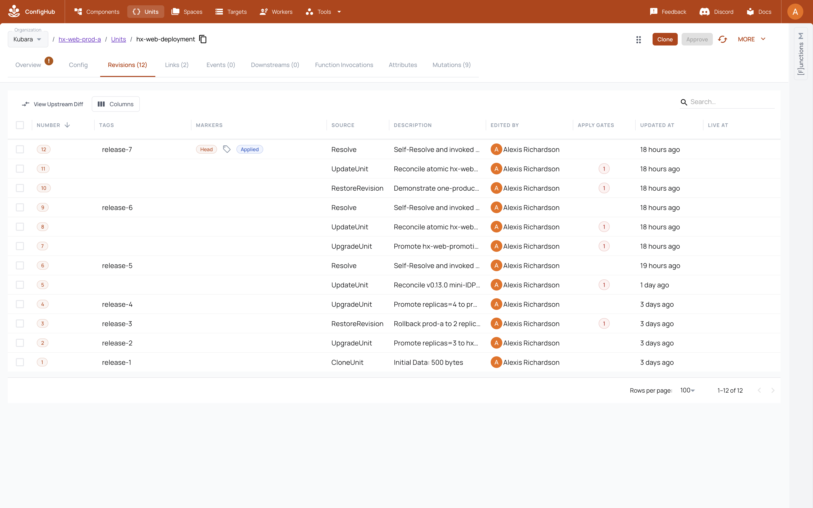

# Step 6: Add, promote, and deploy applications

## Your goal

Deploy applications onto the governed Kubara platform, promote exact revisions
from development through staging to production, retain target-specific
departures, and roll back one target without rolling back its peer.

ConfigHub governs the application revision and release. Each cluster's local
Argo CD instance continues reconciling the released OCI digest. The application
is not hidden inside the platform import and the importer does not invent its
source code.

## What stays Kubara

- The application consumes the ingress, certificate, secret, monitoring, and
  other services that the Kubara platform provides.
- Kubara's generated namespaces, ingress class, ClusterIssuer, and platform
  wiring remain meaningful to application authors.
- Argo CD remains the in-cluster reconciler and reports sync and health.
- The application source can remain in its own repository and release cadence;
  it is not folded into Kubara's portable platform package.

## What ConfigHub adds

- A reusable application definition and four independently visible target
  instances.
- Exact `UpgradeUnit` promotion lineage from development to staging and two
  production targets.
- Production approval at server-current `HeadRevisionNum`, with authoritative
  before/after observations binding the Unit ID, observed numeric head, and
  `DataHash`.
- Immutable OCI release digests and source/release history.
- A reviewed target departure that survives later upstream promotion.
- One-target rollback with the peer production target left untouched.
- Native Links from application needs to the platform services that provide
  them, plus a fleet matrix that shows placement and departures.

## The two example applications

The current mini-IDP deliberately uses two applications:

- **hx-web** is the short buyer story: a small digest-pinned NGINX Deployment
  and Service, plus an Ingress and Certificate that use shared Traefik and
  cert-manager services. It exercises promotion, production approval, a
  staging-only departure, and a one-target rollback.
- **Cubbychat** is the richer topology: digest-pinned Postgres, backend, and
  frontend workloads plus platform Ingress and Certificate resources. It shows
  that the same approach is not limited to a one-pod demonstration.

Review their exact source before applying anything:

```text
examples/kubara/current-platform/apps/hx-web/base/
examples/kubara/current-platform/apps/hx-web/platform/
examples/kubara/current-platform/apps/cubbychat/base/
examples/kubara/current-platform/apps/cubbychat/platform/
```

The committed Cubbychat credential is explicitly demo-only. A real adopter
must use their secret-management workflow and keep secret values outside the
portable Git/OCI platform hand-off.

## Before you start

- Step 5's exact platform apply receipt must pass after the zero-action second
  run.
- Every required platform Application must be at its exact release digest and
  meet its `Synced`/health contract.
- The target-fact and secret providers used by the application must exist.
- The production approval policy and reviewers must be configured before a
  production release is attempted.
- The four persistent example clusters must be reachable if reproducing the
  current mini-IDP.

Do not use application success to paper over a platform checkpoint that has not
passed. The app is the consumer proof after platform convergence.

## 6.1 Keep application source separate

Create or reuse an application definition Space from reviewed application
source. Bind only target-neutral manifests in the definition. Put platform
bindings such as Certificate and Ingress into their reviewed application
configuration rather than copying a platform controller into the app.

If an application Application already exists in an apps-root Space, declare it
under `delivery.workloadApplications` in the import request before completing
Step 5. Rerun destination inspection so the importer pins its Unit ID,
`DataHash`, raw-byte hash, published head, source IDs, and release manifest
digest. That preservation changes only `BindingDigest`, not `PlatformDigest`
or target-neutral package bytes.

## 6.2 Create the promotion topology

Create one target instance for each environment and retain explicit lineage:

```text
application definition
        |
        v
development -> staging -> production A
                       `-> production B
```

For the example, hx-web uses the definition Space `hx-web-base` and instance
Spaces `hx-web-dev`, `hx-web-staging`, `hx-web-prod-a`, and `hx-web-prod-b`.
Cubbychat follows the same four-target placement. Separate platform-binding
instances make each app's Certificate and Ingress relationship visible without
mixing those resources into the portable platform import.

## 6.3 Release to development first

Publish the exact reviewed development revision. Publication makes the release
discoverable; it does not authorize Argo to deploy mutable `latest`. The
managed delivery Application retains `spec.source.targetRevision: latest` only
for discovery and has no `spec.syncPolicy.automated` field. The pinned argobot
v0.1.6 runtime (`ARGO_SYNC_MODE=kubernetes`, `ARGO_NAMESPACE=argocd`,
`ARGO_REFRESH_TYPE=hard`) may hard-refresh that Application, but cannot sync it.

The ConfigHub reconciler then revalidates the exact authoritative release and
Unit heads, accepts no active Argo operation, and submits
`operation.sync.revision=<ManifestDigest>` using Kubernetes
`metadata.uid`/`metadata.resourceVersion` compare-and-set. Require the delivery
Application to observe that exact digest, then require `Synced` and the
workload health named by its contract. This preserves Argo as the familiar
cluster-local reconciler while preventing a changed `latest` pointer from
bypassing review, approval, or promotion.

Treat retained `release-N` Tags as navigable history, not as deployment
authority. The exact OCI `ManifestDigest` is the release identity submitted to
Argo. The managed path also inventories Applications across every namespace
and rejects ApplicationSets, so a second declarative owner cannot hide outside
the normal `argocd` view.

Only after development passes should the same reviewed source move to staging.
Promotion is an exact upstream-to-downstream operation, not a rebuild from a
mutable tag.

## 6.4 Promote to staging and retain one departure

Promote the exact development revision into staging. In the hx-web example,
staging also receives one reviewed `SANDBOX_URL` environment variable as a
Space-local departure. A later base promotion must update the shared content
while retaining that staging-only field.

The machine proof rejects a departure that leaks into development or either
production target, or disappears during the later promotion.

## 6.5 Require exact approval before production

ConfigHub's approval gate prevents publication of an unapproved production
revision. In the repeatable live run, do not issue a negative publish because
that command has no revision compare-and-set and could race an external
approval. Instead, observe the same gated heads through two authoritative
reads. ConfigHub v0.2.11 rejects a literal numeric approval revision, so the
approval command identifies the Unit by slug and uses the proven
server-current-head selector `--revision HeadRevisionNum`. The reconciler
accepts that operation only when authoritative reads immediately before and
after preserve the same Unit ID, observed numeric head, and `DataHash`, the
gate clears, and the approval count advances exactly once. This is bracketed
exact-head evidence, not a server compare-and-set guarantee from the approval API: another writer
can still race and cause a wrong-head side effect before the post-read detects
it. Hold serialized ownership with no competing writer. After approval, publish the same
reviewed revision to both production targets. Explain the refusal behavior;
show the safer gate observation and exact approval evidence.

An approval for an older revision is not reusable authority for a changed
revision. A ConfigHub release is also not proof that Argo has reconciled it;
retain the exact downstream observation separately.

## 6.6 Roll back one target without moving its peer

Restore production A to its exact earlier accepted revision and publish that
release. Production B remains on the promoted revision. Record both the source
and result Unit heads and release digests so the GUI can show that this was a
one-target rollback, not a new hand-edited payload.

The expected final hx-web shape in the current scenario is:

| Target | Final state |
| --- | --- |
| Development | Three replicas at promotion v2; no staging departure. |
| Staging | Three replicas at promotion v2; retains only `SANDBOX_URL`. |
| Production A | Rolled back to the exact two-replica initial rollout. |
| Production B | Remains at the three-replica promotion-v1 revision. |

## 6.7 Run the reusable adopter application sequence

Start from the checked
[`app-release.example.yaml`](../../../examples/kubara/git-import/app-release.example.yaml).
The request binds the exact ConfigHub Organization coordinate and
`spaceReleaseOCIBase`; every target binds its ConfigHub Target ID, Kubernetes
context, exact kube-system Namespace UID, Argo namespace, and root Application as well as its exact source Unit
head and release digests. The OCI origin is never inferred from `serverURL` and
is included in the release digest.

```bash
node scripts/compile-kubara-app-release.mjs --compile \
  --request /controlled/import/payments-release.yaml \
  --output /controlled/import/payments-release

node scripts/compile-kubara-app-release.mjs --verify \
  --request /controlled/import/payments-release.yaml \
  --output /controlled/import/payments-release

node scripts/run-kubara-app-release.mjs --execute \
  --request /controlled/import/payments-release.yaml \
  --output /controlled/import/payments-release \
  --acceptance-evidence /controlled/evidence/payments-live.json
```

The executable runner uses a durable prepared-before-write journal. It
revalidates the exact ConfigHub coordinate before every ConfigHub mutation,
derives and compares the canonical plan and delivery bytes from the exact
request, and writes one immutable evidence file for every attempt. Each source
Space must contain exactly its one request-bound deployable Unit. After publishing the
delivery root it first fences the live root Application to the exact apps-root
`ManifestDigest` with automated sync absent. It waits for that exact root to
materialize the workload Application, then submits the workload's exact source
digest. Both cluster writes use Kubernetes UID and `resourceVersion` JSON
Patch tests. A concurrent change fails the compare-and-set rather than being
overwritten.

The local PID lock covers only processes that share the same compiled output
directory on one host/filesystem. It does not serialize another output
directory, host, or writer against the same ConfigHub Spaces and Argo
Applications. Operate this sequence under one external writer/lease for those
request-bound resources. ConfigHub approval and publish operations are
read-bracketed but are not transactionally CAS-bound to the pre-read.

If either reconciler has not converged, the runner exits pending at the next
journal step. Rerun the identical command; it resumes by inspecting live state,
not by blindly replaying the prior write. It emits acceptance only after both
Applications are exact-revision, `Synced`, and `Healthy`, followed immediately
by a read-only zero-action audit. Verify the bound evidence with:

```bash
node scripts/run-kubara-app-release.mjs --verify-acceptance \
  --request /controlled/import/payments-release.yaml \
  --output /controlled/import/payments-release \
  --acceptance-evidence /controlled/evidence/payments-live.json
```

This generic contract proves the executable
`argo-synced-and-healthy-exact-source-manifest` health boundary. Application-
specific endpoint, database, or business checks are additional evidence; the
runner does not infer them from Argo health.

## 6.8 Run the current example's richer application sequence

The current repository automates the preceding application operations inside
the complete mini-IDP reconciler rather than asking a user to replay dozens of
manual mutation commands:

```bash
npm run kubara-mini-idp:plan
npm run kubara-mini-idp:apply
npm run kubara-mini-idp:apply
npm run kubara-mini-idp:verify
npm run kubara-mini-idp:receipt-verify
```

The first apply uses a durable write-ahead operation journal for every hx-web
promotion, gate observation, approval, departure, publication, and rollback
transition.
If interrupted, rerun the exact same command and inputs. Do not manually replay
the remaining history; the journal accepts only the exact durable prefix.

The second apply is mandatory and must make zero semantic changes. The receipt
distinguishes an executed scenario from retained, already-proved history so
reconciliation does not manufacture duplicate promotions on every run.

The same durable journal records 16 reviewed immutable-selector replacements
required to bring a retained fleet to the current hx-web and Cubbychat label
contract. Four are hx-web Deployments; the other 12 are Cubbychat backend,
frontend, and PostgreSQL workloads across four targets. The retained v1
history honestly preserves the trigger used at the time: four recovery rows
followed an Argo resource failure and 12 used the earlier reviewed-preflight
path. Those completed rows are not rewritten. For every new attempt, the v2
policy first submits the exact expected OCI revision and requires Argo to
record that exact resource's terminal immutable-selector failure, with the
failure object and digest journaled. Only then may the old resource be deleted
with exact UID/resourceVersion preconditions; the replacement must be healthy
with ready endpoints. Each
PostgreSQL replacement preserves the same bound PVC UID and volume identity.
This is migration evidence for an existing platform, not an ordinary rollout
pattern and not permission for broad deletion.

After application and platform convergence, run the Step 5 orphan audit before
publishing the GUI tour or fleet matrix as current.

## 6.9 Verify the actual applications

For each hx-web and Cubbychat target, require all of the following:

1. the ConfigHub release manifest digest equals the digest expected by the
   current plan and receipt;
2. Argo reports that exact digest, not an older `Synced` revision;
3. sync is `Synced`;
4. health meets the reviewed application contract;
5. the expected workloads, Services, Ingresses, and Certificates exist; and
6. native Links connect the application needs to the selected platform
   providers.

Once the current receipt passes, the local kind example can also be exercised
through its reviewed NodePorts:

```bash
curl -H 'Host: hx-web.local' http://127.0.0.1:30002/
curl --insecure --resolve cubbychat.local:30003:127.0.0.1 \
  https://cubbychat.local:30003/
```

Use Traefik port pairs `30012/30013`, `30022/30023`, and `30032/30033` for
staging, production A, and production B. Their first window ports (`30010`,
`30020`, and `30030`) remain reserved for `argocd-server`. `--insecure` is
acceptable only for this explicitly self-signed local proof.

## Expected state and evidence

The accepted current example must show:

- hx-web and Cubbychat definition and per-cluster instance Spaces;
- both apps delivered to development, staging, production A, and production B;
- exact source revisions and OCI digests for every target;
- stable production gate observations followed by server `HeadRevisionNum`
  approvals bracketed by unchanged Unit ID, observed numeric head, and
  `DataHash`;
- one retained staging departure;
- one exact rollback on production A while production B remains promoted;
- current Argo sync and workload health at the exact release digests;
- curated app-to-cert-manager and app-to-Traefik Links; and
- a scoped ConfigHub/Argo/workload residue audit after convergence.

The passing current evidence belongs in:

```text
runs/kubara-mini-idp-reconcile/receipt.yaml
runs/kubara-mini-idp-reconcile/orphan-audit.yaml
```

The source-current mini-IDP receipt now reports `pass` and proves current v0.13
app health, exact-head approval evidence, promotion, retained departure,
one-target rollback, immutable releases, selector migrations, and the
immediate zero-action rerun. The scoped residue claim and screenshot publication
remain separate: they require the source-current orphan receipt and the
pre-capture evidence gate rather than being inferred from application health.

There is a real retained v0.12 compatibility proof at
[`runs/kubara-app-rollout-proof/receipt.yaml`](../../../runs/kubara-app-rollout-proof/receipt.yaml).
Verify it with:

```bash
npm run kubara-app-rollout:verify
```

That historical receipt proves the earlier promotion, approval, rollback,
departure, and four-cluster application behavior. It must be labelled
historical and cannot substitute for the current v0.13 checkpoint.

## Machine checkpoint

The current application checkpoint is:

```bash
npm run kubara-mini-idp:receipt-verify
npm run kubara-mini-idp:orphan-audit:receipt-verify
```

Both must pass for the same source commit. Then regenerate the live-aware
matrix:

```bash
npm run kubara-platform-matrix:generate
npm run kubara-platform-matrix:verify
```

The matrix must leave any field without exact receipt evidence `unknown`. Each
cell carries two explicit planes: Kubara/ConfigHub desired placement, selected
version, and departure; then the receipt's exact ConfigHub release digest,
Argo observed revision/sync/health, and Kubernetes desired/ready counts. A
disabled selection is `NotApplicable`. A desired-only cell is useful
deterministic evidence, but it is not a live application-health claim.

## Screenshot to capture after the checkpoint passes

Do not use the historical GUI or generated desired state as a current
screenshot. This chapter owns exactly one future adoption frame, separate from
the ConfigHub GUI tour.

<!-- kubara-adoption-screenshot step="6" id="app-governance-live" path="../../images/kubara-adoption/06-app-governance-live.png" -->



After the current receipts, the GUI tour's
[pre-capture gate](gui-tour.md#pre-capture-gate), and the complete
source-current live gate pass, capture
one real ConfigHub browser frame with hx-web open and these identities visible
in the application and history surfaces:

1. development, staging, production A, and production B placement at exact
   source revisions and OCI digests;
2. the exact production revision/data hashes and approval;
3. staging's retained `SANDBOX_URL` departure after promotion;
4. production A's rollback source/result beside production B's unchanged
   promoted head; and
5. current Argo revision, `Synced`, and accepted health for the selected live
   result.

Use the surrounding tutorial, rather than extra adoption frames, to point to
Cubbychat's three-tier topology as evidence that the model handles a richer
application. The caption must name the source commit, organization, accepted
receipt, and capture date, and must state which parts prove governance,
release identity, and live cluster health. Embed the real frame at the
declared path only when the six-frame adoption receipt binds the exact source
commit and Git trees, mini-IDP and orphan receipts, matrix and wiring hashes,
image digest, UTC capture time, visible identities, sensitive-value handling,
caption, and claim boundary. Until then, leave the hook unexpanded.

## Troubleshooting

| Symptom | What it means | Safe response |
| --- | --- | --- |
| The platform has not converged | Application prerequisites are not ready. | Stop application promotion and finish Step 5. Do not treat a running app as proof of a healthy platform. |
| Production publication returns an approval refusal | The exact production heads are not approved. | Treat the refusal as expected policy evidence, approve the exact Unit revisions/data hashes, then republish without changing them. |
| Argo says `Synced` at another digest | The cluster is observing an older release. | Reconcile the exact current ConfigHub release and verify its digest before assessing health. |
| Argo stays `Progressing` | Controller aggregate health has not met the contract. | Inspect the Application and Kubernetes workloads; retain `watch` or `fail` rather than writing `pass`. |
| The staging departure vanished or appeared elsewhere | Promotion or merge-base semantics are wrong. | Stop, retain the evidence, and repair the reviewed lineage. Do not re-add the field manually after promotion. |
| Production B moved during production A rollback | Rollback scope was not isolated. | Stop the demo and investigate exact Unit/release heads; both targets must not be called correct. |
| A rerun tries to replay part of hx-web history | The durable operation journal and live state disagree. | Preserve the journal and receipts and fail closed. Do not delete markers or manufacture a new history. |
| `curl` cannot reach the kind app | NodePort, Host/SNI, Certificate, Service, or workload convergence is incomplete. | Check the exact target's Argo Application and Kubernetes resources. Do not weaken the live checkpoint to pod-only health. |
| Receipt verification reports a missing file | That separate evidence boundary has not run for the current source. | Keep only the claims supported by the receipts that do pass; run the missing serial qualification and never infer orphan or screenshot evidence from the app receipt. |

## Safe to stop

It is safe to stop after a fully verified development or staging release; do
not begin production until the approval policy is in place. If the scripted
hx-web governance scenario is interrupted, preserve its operation journal and rerun the
same `kubara-mini-idp:apply`. The journal is the recovery authority.

After the first complete mini-IDP apply, stop only with the result clearly
marked pending idempotence. The immediate second zero-action apply and receipt
verification are required before publishing evidence. Never delete the four
persistent example clusters as tutorial cleanup.

Previous: [Step 5 — materialize the selected organization](adoption-5-confighub-org.md)

Next: [walk through the proved result in the ConfigHub GUI](gui-tour.md), then
consult the [evidence checkpoint ledger](checkpoints.md).
