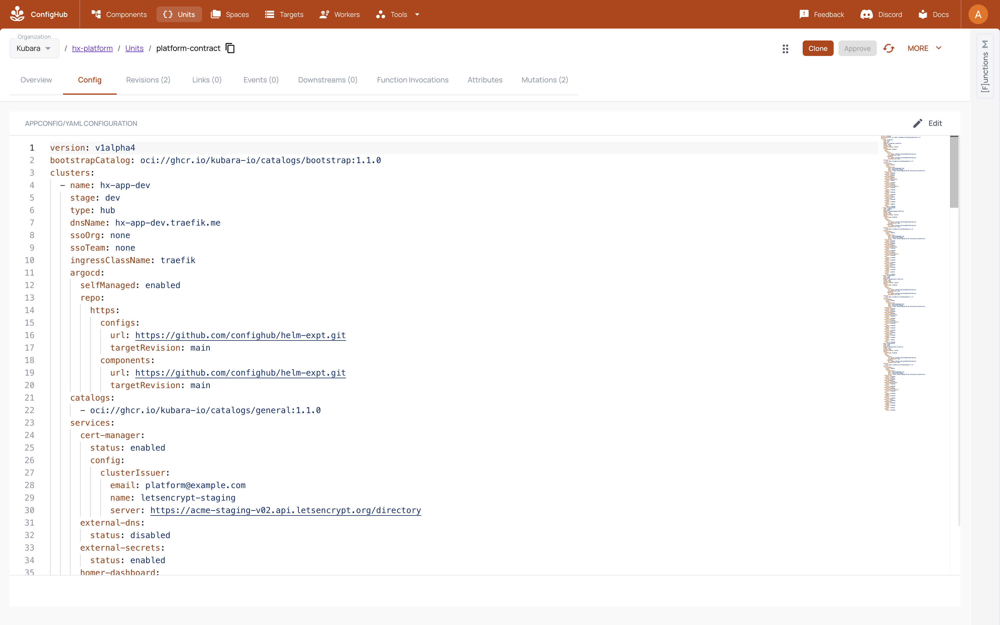
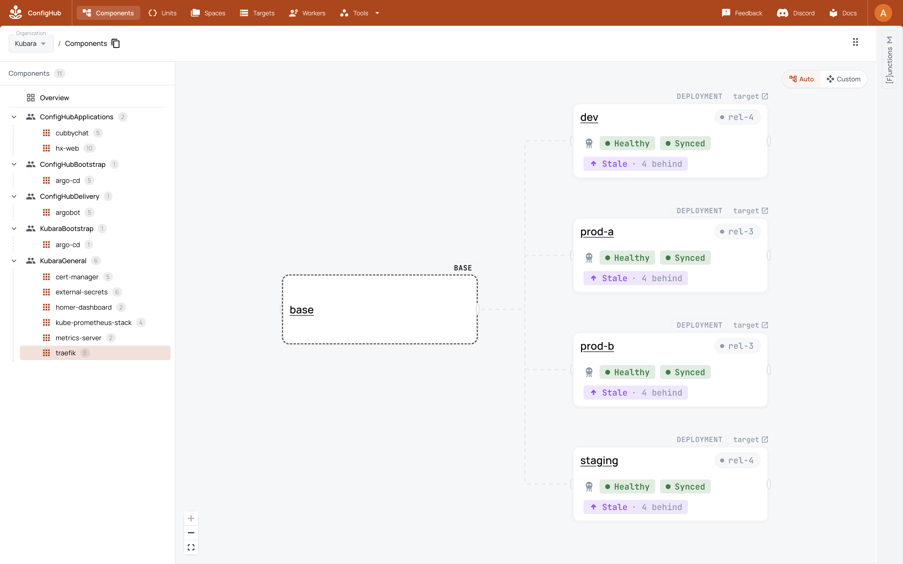
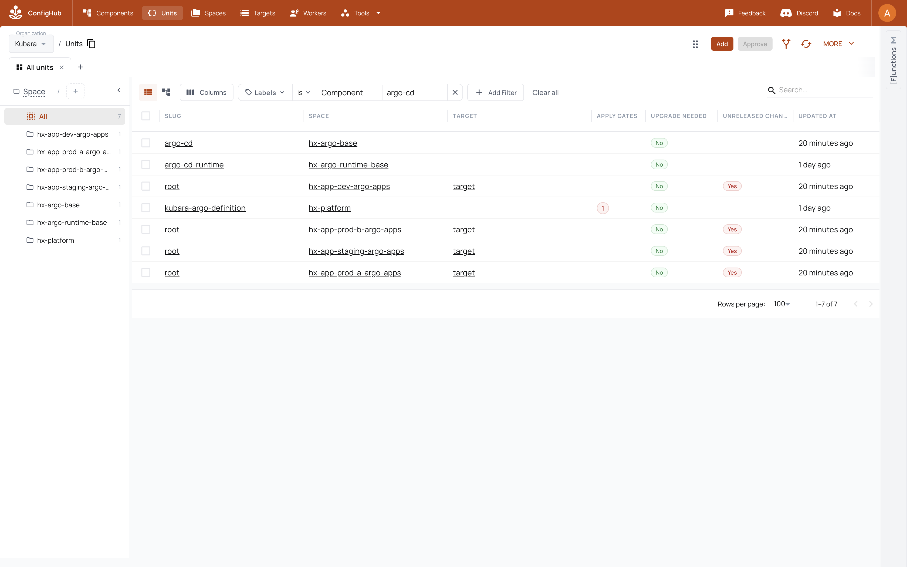
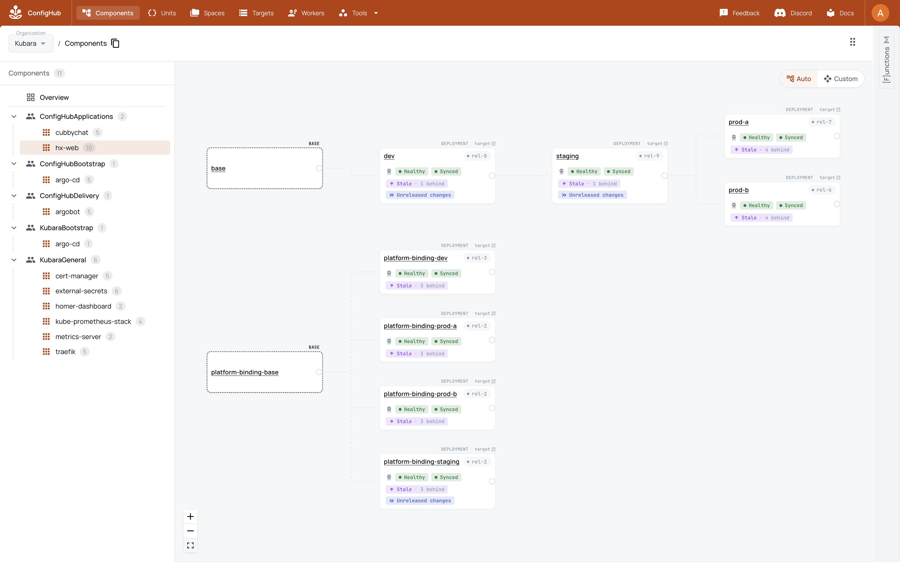
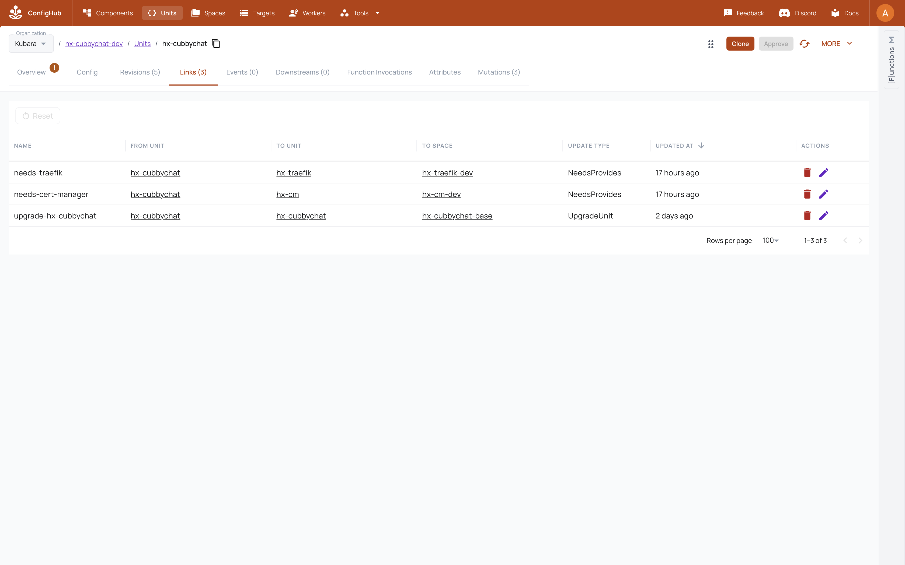
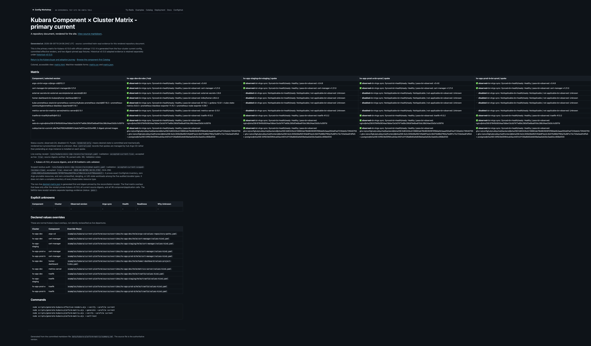

# See the Kubara platform in ConfigHub

This is the screenshot and live-GUI companion to the
[six-step adoption tutorial](adoption.md). It shows the Kubara shape
first, then the additional governance and visibility ConfigHub provides.

Do not use a screenshot as current evidence merely because the UI looks
plausible. Capture and publish the screenshot set only after the
[current live release checkpoint](checkpoints.md#current-live-release-checkpoint)
passes. Each image must be tied to the same source commit, organization,
receipt, and capture date.

## Pre-capture gate

Run this gate before opening the browser or creating
`data/kubara-gui-evidence/receipt.yaml`:

```sh
npm run kubara-release:verify-static
npm run kubara-faithful-hub-spoke:verify
npm run kubara-mini-idp:receipt-verify
npm run kubara-mini-idp:performance:receipt-verify
npm run kubara-mini-idp:orphan-audit:receipt-verify
npm run kubara-platform-matrix:verify
npm run kubara-wiring:verify
```

This gate deliberately does not require screenshots, so it cannot be satisfied
by the images it is meant to authorize. It must bind one source commit and one
organization to a current faithful receipt, current adapted receipt, the
immediate zero-action run, disclosed performance, exact ConfigHub inventory and scoped Argo/workload residue, and
the exact matrix and wiring inputs. Today the measured no-op is 33 ConfigHub
CLI read commands, 208 total subprocess calls, and about 77 seconds with zero
ConfigHub mutation attempts and zero Argo sync requests. It meets the fixture
regression target; those commands are not HTTP round trips, and the measurement
is not a raw-Kubara comparison, speed claim, or service-level promise.

If any command fails or any input changes after it passes, capture nothing (or
discard the uncatalogued capture) and rerun the gate. Only then capture exactly
six real frames under `docs/images/kubara/`, create the GUI receipt with every
required hash and caption, embed all six frames atomically, and run
`npm run kubara-release:verify`. Do not add placeholder, mocked, historical,
partial, or receipt-free screenshots.

## Tour order

### 1. Start at the platform contract

Open the Unit labeled `StartHere=true` and the
`hx-platform/platform-contract` record.

Show:

- Kubara version and exact source Git revision;
- the one-hub/three-spoke platform identity;
- the seven selected platform roles;
- links to the Catalog, matrix, wiring evidence, and both delivery lanes; and
- the exact receipt status behind the tour.

Key takeaway: **this is the same Kubara platform, with its source and evidence
made navigable.**

Screenshot checkpoint: platform contract header, source identity, and
navigation labels in one frame.



### 2. Browse components before platform instances

Open the ConfigHub component Catalog before showing target-specific Units.

Show:

- a familiar Kubara-selected component;
- its retained older and newer versions;
- deployable variants and configurations as follow-on views;
- exact chart source and OCI digest metadata; and
- the platform instances that selected that component version.

If an instance card says `Stale · N behind`, keep it visible and explain the
scope: this is ConfigHub's upstream definition/variant departure signal—an
available governed update—not evidence that Argo is OutOfSync. The release
digest, Argo revision, sync/health, and workload readiness are proved
separately in the platform matrix. A deliberately pinned instance can be
Synced and Healthy while still showing that newer definition revisions exist.

Key takeaway: **Kubara still chooses and wires a platform package; ConfigHub
makes each reusable component and every retained version independently
governable.**

Screenshot checkpoint: one component, its version history, and its instance
relationship.



### 3. Show the recognizable delivery shape

Display the faithful and adapted Argo definitions side by side.

Show:

- `Lane=Faithful`: Kubara's hub Argo, AppProject, ApplicationSets, and spoke
  registration remain recognizable;
- `Lane=Adapted`: ConfigHub takes the governance/hub role while each target
  keeps its local Argo reconciler; and
- the four explicit target clusters and environments;
- `targetRevision: latest` labelled as discovery-only and
  `spec.syncPolicy.automated` absent from every managed Application; and
- the pinned argobot v0.1.6 refresh-only settings:
  `ARGO_SYNC_MODE=kubernetes`, `ARGO_NAMESPACE=argocd`, and
  `ARGO_REFRESH_TYPE=hard`.

Key takeaway: **ConfigHub adds a simpler operating lane without declaring the
Kubara topology wrong or removing the faithful option. Argo remains local, but
a mutable `latest` pointer cannot bypass ConfigHub governance.**

Screenshot checkpoint: both lane cards plus the four target relationships.



### 4. Follow one application through four clusters

Use hx-web as the short story and Cubbychat as the richer application.

Show:

- development, staging, production A, and production B instances;
- the exact source revision and OCI digest at each target;
- one target-specific departure;
- production approvals performed at server `HeadRevisionNum`, bracketed by
  unchanged Unit ID, observed numeric head, and `DataHash`;
- promotion history;
- an exact rollback on one production target;
- the 16 journaled selector replacements and the four unchanged bound
  PostgreSQL PVC identities;
- the authoritative ConfigHub `ManifestDigest` beside Argo's observed
  revision; and
- receipt evidence that the reconciler submitted
  `operation.sync.revision=<ManifestDigest>` only after exact release
  revalidation, no active operation, and Kubernetes UID/resourceVersion
  compare-and-set.

Key takeaway: **the platform definition and the application release are
separate, but their target placement and history are visible together; the
approved digest, not mutable `latest`, is what Argo reconciles.**

Screenshot checkpoint: one application detail frame with the four target
placements and its approval, promotion, departure, and rollback history visible
together. This is frame 4 of the six-frame tour, not four additional images.



### 5. Open the wiring

Start with curated native `NeedsProvides` Links, not the entire extracted graph.

Show relationships such as:

- application Ingress to ingress class;
- application Certificate to ClusterIssuer;
- Grafana Secret to ExternalSecret or SecretStore; and
- component instances to shared platform capabilities.

Then link to the complete generated wiring evidence for engineering review.

Key takeaway: **relationships that were implicit in folders and generated
YAML can become queryable platform facts.**

Screenshot checkpoint: a small, legible set of native Links with both ends
visible.



### 6. Finish with the fleet matrix and clean inventory

Open the 36-cell component/application-by-cluster matrix and the exact scoped
residue-audit result.

Show:

- selected, centralized, and disabled placement;
- desired placement/version/departure separately from the observed ConfigHub
  release digest;
- Argo's exact observed revision, sync, and health separately from Kubernetes
  desired/ready workload counts;
- target departures; and
- zero unexpected ConfigHub objects, dangling Links, Argo-prunable resources,
  or unclassified, dangling, or UID-stale audited durable workloads.

A disabled selection is `NotApplicable`. A desired cell without an accepted
source-current observation is `Unknown`; the matrix must never turn desired
state into inferred runtime health.

Key takeaway: **Kubara's platform matrix becomes current data, and the demo
organization's governed inventory is proved clean rather than merely looking
tidy. The receipt does not claim a complete inventory of every Kubernetes
resource type.**

Screenshot checkpoint: current matrix plus the scoped residue receipt identity.



## Explain, but do not spend the demo running

- the long preparation and release qualification pipeline;
- package media types and every member of the platform digest index;
- content-addressed reconciliation and compare-and-set safety internals;
- target-fact and secret isolation mechanics;
- the entire extracted wiring graph; and
- a long cold import while the buyer waits.

These details remain available in the
[technical mini-IDP reference](single-platform.md), the
[importer guide](../../../examples/kubara/git-import/README.md), and the
[reconciliation performance analysis](reconciliation-performance.md).

Do explain one boundary plainly: the evidence controls the managed automated
delivery path. It does not prove that a privileged human cannot issue a manual
Argo sync unless separate RBAC or admission evidence is also shown.

## Screenshot evidence contract

For every published GUI image, retain alongside the image:

- capture date and UTC time;
- exact source commit;
- ConfigHub organization external and internal IDs;
- Space, Unit, Link, or Component identities visible in the frame;
- exact faithful, mini-IDP, and orphan receipt hashes;
- exact public matrix and full wiring graph hashes;
- the screenshot file's own SHA-256 digest;
- whether sensitive values were absent or redacted; and
- a short caption that states exactly what the image proves and does not prove.

The atomic receipt path is `data/kubara-gui-evidence/receipt.yaml`. It must
record exactly six images and bind `sourceCommit`, both organization IDs,
faithful, mini-IDP, orphan, matrix, and wiring SHA-256 values. Every image record
must bind its repository-relative path, SHA-256, exact UTC capture time,
visible identities, sensitive-value handling, caption, and claim boundary.

The website generator should refuse to present the screenshot set as current
when any source, organization, receipt, artifact, screenshot digest, or capture
time no longer matches the accepted evidence chain. The six frames are one
atomic evidence set: do not publish a partial tour as current.

Next: use the [complete technical reference](single-platform.md) to reproduce
the result.
