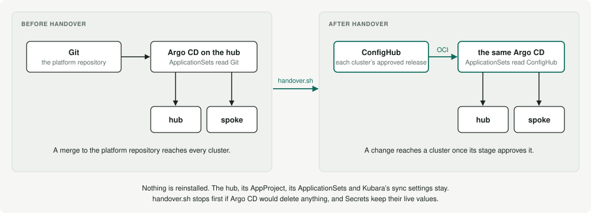

# Run a Kubara platform through ConfigHub with cub kubara

`cub kubara` is a plugin for the ConfigHub CLI. It takes a Kubara platform,
either one you are about to create or one Kubara has already generated, and
shows what ConfigHub would hold for it: a base for each component, a variant
for each cluster it runs on, and the order a change rolls out in. That much
works offline, with no account and no cluster, and changes nothing. When you
are ready, it writes the cub steps that bring the platform into ConfigHub as
one script you read before you run it.

Kubara keeps doing what it does. Its catalogs stay the source of every
component, and Kubara still generates the platform. The ConfigHub Workshop
Catalog adds evidence: where it has checked the exact chart version Kubara pins,
the plan links to what that chart installs and what it needs.

To see all of it before you use your own platform, run the
[kind lab](../../examples/kind-lab/README.md). It builds a Kubara hub and spoke
on your laptop and runs every step below against them.

**Already run Kubara?** Skip `init`. Install the plugin, then run
[`plan`](#see-the-plan) and [`render`](#render-the-platform-as-kubara-delivers-it)
on your platform's work directory. Both run offline in seconds, need no
account, and change nothing. Read
[what each step changes](#what-each-step-changes-and-how-to-undo-it) and the
[known limits](#known-limits) before you run `apply.sh` or `handover.sh`.

### Words ConfigHub uses

- **Space**: a folder in your ConfigHub organization. Everything below lives
  in Spaces named `<prefix>-…`, `kubara-…` by default.
- **Unit**: one piece of configuration in a Space, here one Kubara service's
  rendered objects. Each change to it is a **revision**.
- **Base** and **variant**: a base Space holds a component's shared config. A
  variant Space is a copy of it for one cluster, and can differ from it.
- **Component**: groups a base and its variants.
- **Change workflow** and **change order**: a change workflow orders the
  stages and says what each needs. A change order is one change moving
  through them.
- **Release**: a fixed bundle of a variant's config, served as OCI. Argo CD
  pulls releases after handover.
- **Target** and **worker**: a Target is where a variant's releases go, here
  one per cluster. A worker is a non-personal identity. Here Argo CD pulls
  releases with it, and argobot reports status with it.
- **Attestation**: a recorded claim about revisions, such as an approval or a
  check result.

The [ConfigHub docs](https://docs.confighub.com/background/entities/space/)
explain each in full.

## How Kubara, cub kubara and Workshop stacks fit together

Three pieces meet here, and each has one job.

**Kubara generates the platform.** You write a `config.yaml` that chooses services
from Kubara's catalogs. `kubara generate` writes a wrapper chart for each service
and each cluster's values. Kubara's hub Argo CD then delivers to every cluster
through ApplicationSets. Kubara knows nothing about ConfigHub.

**`cub kubara` is for people who run Kubara.** It governs a Kubara platform in
ConfigHub without changing how Kubara works. Your path is:

```text
kubara generate  →  cub kubara plan  →  cub kubara apply  →  cub kubara handover  →  cub kubara check
```

`cub kubara handback` undoes handover, if you want Git to deliver again.

Kubara generates. `cub kubara` puts the result under ConfigHub's governance, as a
base for each component and a variant for each cluster, with an approval before
each release. `handover` then points Kubara's hub at the approved releases, and
`check` confirms that each cluster runs them. There is no stack step on this path.

`cub kubara apply` renders each service the way Kubara's hub delivers it. It uses
the chart its ApplicationSet names, with the same release name, namespace and
values files, in the same order. bootstrap-crds becomes the CRDs `kubara bootstrap`
applies, and nothing else. It uses `helm` today. Once `cub helm template` can declare
capabilities ([confighub/cub-helm#2](https://github.com/confighub/cub-helm/issues/2)),
it uses `cub helm` and writes the certified bundle shape directly.

**Workshop stacks serve a different job:** using a Kubara platform as a stack,
rather than governing it the way Kubara runs it. Reach for `cub stack` when you
want to:

- check the platform before anything runs, for components that conflict, CRD
  order, and webhooks that need a certificate;
- compose apps onto it with `cub app`;
- publish it as OCI, or place it on clusters without Kubara's hub Argo CD;
- produce a platform on demand, when someone asks their AI for one. Kubara is one
  way to produce it, and the result is a stack like any other.

`cub stack from-kubara` makes that stack: one stack for the whole platform,
with a component per service and a variant per cluster. `--cluster` narrows
it to one cluster.

The two tools share only the renderer and the certified bundle format. The
renderer is `cub kubara render`, below, and `cub stack from-kubara` builds its
stack from what it writes. See
[one flattening model for every plugin](https://github.com/confighub/helm-expt/blob/main/docs/reference/flattening-across-plugins.md)
for the rules they share.

## Install

```bash
cub plugin install confighub/kubara-confighub
cub kubara version
```

To pin a release, install its tag, such as
`cub plugin install confighub/kubara-confighub@v0.2.3`.

What each step needs, with the versions it was tested with:

| Step | Needs |
| --- | --- |
| `services`, `init`, `plan` | the `cub` CLI (v0.6.8) and the plugin. No account. |
| `render` | the above, and `helm` (v4.1). No account. Helm may need network access to fetch charts. |
| `kubara generate` | [Kubara](https://github.com/kubara-io/kubara) v0.15 or newer (v0.15.0 and v0.16.0). |
| `apply --capabilities` | a `kubectl` context for each cluster, read only. |
| `apply.sh` | a ConfigHub organization and `cub auth login`, with rights to create Spaces. |
| `handover.sh`, `handback.sh` | the above, rights to create workers and Targets, `kubectl` access to Kubara's hub that can write in the `argocd` and `argobot` namespaces, and `jq`. The hub needs Argo CD 3.1 or newer; Kubara ships 3.5. `handover.sh` pulls `ghcr.io/confighub/argobot` onto the hub. |
| `check` | a ConfigHub organization, and `kubectl` read access to Kubara's hub. |
| `cub stack from-kubara`, `cub stack check` | the [ConfigHub Workshop](https://github.com/confighub/cub-workshop) plugin (`cub plugin install confighub/cub-workshop`), with `node` and `oras`. No account. |

The scripts use your current `cub` context, and write to the organization it
points at. Set `CUB_CONTEXT` to choose another. `handover`, `check` and
`handback` expect releases at `oci.hub.confighub.com`. If your ConfigHub
serves them elsewhere, pass `--gateway`.

## See what a Kubara catalog offers

```bash
cub kubara services
```

This lists the services in Kubara's 3.0 catalogs, the default for Kubara v0.16.
The bootstrap catalog's services are always installed. You choose from the
general catalog's services. Under each service is the upstream chart and version
Kubara pins, with what the Workshop Catalog says about it:

- **checked** links to the Workshop page for that exact version;
- **Workshop has 41.0.2** means the Workshop has checked a different version of
  the same chart, not the one Kubara pins;
- **unchecked** means the Workshop Catalog has no entry for that chart.

**(on by default)** marks a service Kubara's own config enables unless you
turn it off. `cub kubara init` enables only the services you pass with
`--services`.

Add `--catalog-version 5.1.0` for Kubara's newest catalogs, or
`--catalog-version 1.1.0` for the ones the committed examples use. Kubara
released general 5.1.0 with bootstrap 5.0.1, so `init` writes that pair, and
`plan` reads it. 5.1.0 adds crossplane, in a new infrastructure category.
There is no general 5.0.1.

## Start a new platform

```bash
cub kubara init --out my-platform \
  --services cert-manager,metrics-server,traefik \
  --hub hub-dev:dev --spoke edge-staging:staging --spoke edge-prod:prod \
  --repository https://github.com/acme/platform.git
```

`init` writes three files into `my-platform`:

- `config.yaml`, Kubara's own configuration, with the catalogs pinned and your
  services enabled on each cluster that can run them;
- `.env.example`, with placeholders only and no secret;
- `confighub-intent.yaml`, a record of the catalogs, the chart version each
  service pins, and the Workshop evidence for each.

A Kubara config has exactly one hub. Pass `--hub` once: today a second
`--hub` replaces the first without a word
([#35](https://github.com/confighub/kubara-confighub/issues/35)). `init`
refuses to overwrite an existing `config.yaml`. A service that runs only on the
hub, such as `homer-dashboard`, is left out of the spokes, and `init` says so.

Each cluster's DNS name is `<cluster>.traefik.me`, and cert-manager's ACME
contact is `platform@example.com`. Set your own with `--dns-domain` and
`--email`. Let's Encrypt refuses an `example.com` contact, so cert-manager's
issuer stays unready until you do.

Then let Kubara generate the platform:

```bash
cp my-platform/.env.example my-platform/.env   # then fill in the values it asks for
kubara --work-dir my-platform --config-file config.yaml --env-file .env generate --helm
```

`.env` holds the Argo CD password and your Git token. `init` writes no
`.gitignore` yet ([#38](https://github.com/confighub/kubara-confighub/issues/38)),
so add one before you push the work directory to Git. Kubara's own
`kubara init --prep` writes one. At least leave out `.env`, `**/charts/`,
`**/Chart.lock` and `**/*.tgz`: `render` and `apply` let helm fetch chart
dependencies into the work directory.

## See the plan

```bash
cub kubara plan my-platform
```

`plan` reads a Kubara work directory or a `config.yaml`. When Kubara has already
generated the platform, it reads the exact chart versions Kubara wrote.
Otherwise it takes them from the catalog. For this example the plan shows three
stages, dev, staging and prod, from each cluster's `stage` field. Each
component gets a base and a variant for every cluster it runs on. Every chart is listed with its evidence, and a summary line counts
how many were checked at the exact version.

Kubara's hub, AppProject and ApplicationSets stay as Kubara generates them:
the hub's Argo CD delivers to the spokes. `plan` exits non-zero when it finds
something to fix first, such as two hubs, a service the catalog does not
define, or a hub-only service on a spoke.

Pass `--stages dev,canary,prod` to set the stage order yourself, and
`--prefix` to change the prefix of everything the plan would create.
`--stages` must name every stage your `config.yaml` uses, once each. A stage
it leaves out, a stage no cluster has, or a stage named twice is refused, and
the error says which:

```text
error: --stages dev,prod leaves out staging, the stage of edge-staging.
Name each stage config.yaml uses once, in the order a change reaches them, such as --stages dev,staging,prod, or leave --stages out for that default order
```

Without `--stages`, the order is dev, staging, prod, then any other stages.
Read the stage order `plan` prints before you go on.

Pass the same `--prefix` and `--stages` to `apply`, `handover`, `check` and
`handback`. Each of them finds the Spaces by that prefix and stage order, and
each refuses a `--stages` that does not name every stage once.

## Render the platform as Kubara delivers it

Once Kubara has generated the platform, `render` shows exactly what Kubara's
hub would deliver to each cluster:

```bash
cub kubara render my-platform --out my-platform-render
```

For each cluster in `config.yaml`, each service it runs renders from its
wrapper chart. It uses the release name, namespace and values files the
service's ApplicationSet uses, in the same order. bootstrap-crds renders as the
CRDs `kubara bootstrap` applies, and nothing else. A hub also runs Argo CD. It
is the same renderer `apply` uses, and it needs `helm` on your PATH.

`render` contacts no cluster and no ConfigHub server, and needs no account.
Helm may fetch a chart's dependencies from its Helm repository into the work
directory, as `apply` does. They land in `platform-components/helm/*/charts/`,
with a `Chart.lock`, so keep them out of Git (see [`.gitignore`](#start-a-new-platform)).
`render` and `apply` read `config.yaml` in the work directory. Only `plan`
also takes a config file by path.

On a small platform `render` takes about 10 seconds. With Kubara's default
services on one hub it took about 25.

It writes one directory per cluster and service, and a manifest:

```text
my-platform-render/
  render.json                      what was rendered, and how
  hub-dev/
    bootstrap-crds/objects.yaml    the CRDs kubara bootstrap applies
    argo-cd/objects.yaml
    cert-manager/objects.yaml
  edge-prod/
    ...
```

Each `objects.yaml` holds a service's objects as one YAML file, in the order
helm writes them. Secrets keep their keys and lose their values, as in `apply`.
Pass `--keep-secret-values` to keep them. They can be credentials a chart
generates when it renders.

Useful flags:

- `--cluster <name>` renders only that cluster. Repeat it for more.
- `--json` prints `render.json` to stdout instead of a summary.

Running `render` again into the same `--out` replaces the earlier render. It
refuses a directory that holds anything else.

### render.json

`render.json` is for programs, such as `cub stack from-kubara`. Its
`apiVersion` is `kubara.confighub.com/v1alpha1` and its `kind` is
`KubaraRender`. A change that could break a reader gets a new `apiVersion`.

| Field | What it holds |
| --- | --- |
| `generator` | The command and plugin version that wrote it. |
| `source.workDir` | The Kubara work directory, as you gave it. |
| `source.configSha256` | The digest of `config.yaml`. |
| `source.bootstrapCatalog` | The bootstrap catalog `config.yaml` names. |
| `secretValues` | `emptied`, or `kept` with `--keep-secret-values`. |
| `clusters[]` | Each cluster rendered, in `config.yaml` order. |
| `clusters[].name`, `type`, `stage` | The cluster as `config.yaml` names it. `type` is `hub` or `spoke`. |
| `clusters[].catalogs` | The catalogs the cluster reads. |
| `clusters[].enabled` | The services `config.yaml` enables on the cluster, sorted. |
| `clusters[].services[]` | Each service the cluster runs, in the order it rendered: bootstrap-crds, then argo-cd on the hub, then each enabled service. |
| `services[].name` | The chart directory under `platform-components/helm`. |
| `services[].release`, `namespace` | The release name and namespace its Application uses. |
| `services[].delivery` | `applicationset` for a service Kubara's hub delivers, or `bootstrap` for bootstrap-crds. |
| `services[].chart` | The wrapper chart's `name`, `version` and `path`. |
| `services[].upstream[]` | Each chart the wrapper depends on: `name`, `version` and `repository`, as its `Chart.yaml` pins it. |
| `services[].valuesFiles` | The values files passed to helm, in order, after the chart's own `values.yaml`. Paths are relative to the work directory. |
| `services[].apiVersions` | The API versions passed to helm with `--api-versions`: those whose CRDs the services before it provide. |
| `services[].file` | Its `objects.yaml`, relative to `--out`. |
| `services[].objects` | How many objects the file holds. |
| `services[].leftOut` | Objects in bootstrap-crds that `kubara bootstrap` does not apply. 0 for every other service. |
| `services[].sha256` | The digest of the file's bytes, as `sha256:<hex>`. |
| `services[].secrets` | Each Secret written with its keys and without its values. |
| `clusters[].shared[]` | Each object that more than one service on the cluster renders. |
| `shared[].object` | The object, as `apiVersion\|kind\|namespace\|name`. |
| `shared[].services` | The services that render it, in render order. |
| `shared[].owner` | The one service that owns it. Kubara delivers some CRDs twice, from bootstrap-crds and again from a chart, and bootstrap-crds owns those. Empty when no rule decides. |

Each `objects.yaml` holds every object the service's ApplicationSet delivers,
shared ones included, because Argo CD applies them from that Application. To
give each object one owner, drop a shared object from every service but its
owner. [examples/cub-kubara/render-two-clusters](../../examples/cub-kubara/render-two-clusters)
is a complete example: a hub and a spoke, with a CRD two services render.

The same platform renders to the same bytes every time, so each `sha256` is
stable. A chart that makes up a value when it renders, such as a password,
changes its digest on each render, unless that value is in a Secret, whose
values `render` empties.

## Bring the platform into ConfigHub

Once Kubara has generated the platform, `apply` renders every cluster and
writes the steps as a script:

```bash
cub kubara apply my-platform --out my-platform-confighub
less my-platform-confighub/apply.sh
bash my-platform-confighub/apply.sh
```

`apply` renders each cluster the way Kubara's hub delivers it, so each render
holds exactly the objects Kubara's Argo CD runs there. It needs `helm` on your
PATH. It runs nothing in ConfigHub itself.

Argo CD renders each chart with the target cluster's Kubernetes version and the
APIs it serves. To render the same way, give `apply` a kubectl context for each
cluster:

```bash
cub kubara apply my-platform --out my-platform-confighub \
  --capabilities hub-dev=<hub context> \
  --capabilities edge-staging=<staging context> \
  --capabilities edge-prod=<prod context>
```

Without `--capabilities`, a cluster renders with Helm's default capabilities and
the CRDs bootstrap-crds provides, and `apply` says so. On a real platform, pass
it for every cluster: a render that differs from what Argo CD runs makes
`handover.sh` stop on its prune check. `apply` writes `apply.sh`, the plan it
carries out as `plan.txt`, and a directory per component holding its renders
and its rollout workflow.

The script creates a component, a base Space and a rollout workflow for each
Kubara component. The base holds the render of the cluster in the earliest
stage that runs it. The workflow orders the stages, holds each one until the
stage ahead has released, and asks for an approval before each release. Then
the script creates a variant for each cluster. A variant whose cluster renders
differently records that render as its first change, described as Kubara's
values for that cluster. You can run the script again safely. It skips what
exists and leaves alone any change made in ConfigHub since, except that it sets
a workflow's stages and approval rule back to the plan's when they differ, as
when a cluster joins in a new stage or you pass `--allow-authors=false`. When
Kubara generates something new for a base, the script proposes it as a change;
see [a new Kubara catalog](#take-a-new-kubara-catalog-through-the-stages).

Secret values stay out of ConfigHub. A chart can generate a credential at
render time, as Kubara's bundled Grafana does with its admin password, so every
Secret goes to ConfigHub with its keys and without its values. `apply` and the
top of `apply.sh` name each Secret it emptied. The values belong in the
cluster's secret store.

The script creates no Targets and releases nothing. Kubara's hub, AppProject
and ApplicationSets keep delivering from Git. To change the platform, edit a
base, then move the change through the stages with `cub changeorder create`,
`cub variant promote` and `cub variant approve`.

**Who may approve.** Each stage asks for one approval before a release. By
default, `--allow-authors` is true: the person who promoted a change may also
approve it. That suits a first trial. Once a second person approves changes,
run `apply` with `--allow-authors=false`, and run `apply.sh` again. It sets
the approval rule on each workflow. Do it after handover, because
`handover.sh` approves its own first releases (see
[below](#hand-the-hub-to-confighub)).

`cub stack check`, from the ConfigHub Workshop, looks at the platform's render
for conflicts between components, CRD ordering, API versions, webhooks that
need a certificate, and namespaces, offline. It checks each component's base,
or with `--cluster`, what one cluster runs:

```bash
cub stack from-kubara my-platform --out my-platform-stack
cub stack check my-platform-stack/stack.yaml
cub stack check my-platform-stack/stack.yaml --cluster edge-prod
```

Without `--out`, `from-kubara` writes `confighub/` inside the work directory.
It may suggest `cub stack upload --run` next. That creates Spaces of its own,
apart from the ones `apply.sh` creates. You do not need it to govern the
platform with `cub kubara`. If you do upload, give it another
`--space-prefix`.

## Hand the hub to ConfigHub

`handover` writes the steps that follow `apply.sh`. After them, a change reaches
a cluster only once its stage has approved and released it:

```bash
cub kubara handover my-platform --out my-platform-confighub --capabilities hub-dev=<hub context>
less my-platform-confighub/handover.sh
HUB_CONTEXT=<kubectl context of Kubara's hub> bash my-platform-confighub/handover.sh
```



Kubara's hub, AppProject and ApplicationSets stay. Each ApplicationSet whose
chart ConfigHub holds reads the cluster's approved release from ConfigHub's OCI
gateway instead of Git, and Kubara's own sync settings are kept. Argo CD 3.1 or
later reads those releases; Kubara v0.16 ships 3.5.

Steps 0 to 4 of the script change only ConfigHub. It creates a Space
`<prefix>-targets`, with a worker called `server-worker` and a Target per
cluster. It releases every variant an ApplicationSet delivers, through its
rollout workflow, stage by stage, with argo-cd last. In each stage it
promotes, approves and publishes, so **it records an approval in every stage,
prod included, as the person who runs it**. That first release holds what Git
already delivers. If your team needs someone else to approve prod, stop and
read [#40](https://github.com/confighub/kubara-confighub/issues/40) first.
On a re-run it skips a
component whose variants all have a release. A change made since then belongs
to your own change orders, and may be part way through its stages. argo-cd is
the exception, because the script changes its base. Its change order is named
after the base's revision, so a re-run releases a routing change that was not
released yet.

Then the script changes the hub, in steps 5 and 6. Before any change, it
compares what each Application manages with the release it will read. Kubara's
ApplicationSets prune, so the script stops if Argo CD would delete anything.
It then makes these changes:

1. It stores one credential for the gateway, scoped to your prefix's Spaces:
   the worker's ID and secret, in the Argo CD repository credential
   `argocd/confighub-<prefix>-targets`.
2. It applies the AppProject your ApplicationSets use, so that it permits the
   gateway. Kubara's AppProject lists no sources, because its Git repository
   is scoped to the project. The script gives it a list that holds only the
   gateway, and the Git repository stays permitted.
3. It applies each routed ApplicationSet and removes its Git sources. Kubara's
   bootstrap owns those fields, so an apply alone leaves them, and Argo CD
   reads them before the ConfigHub source.
4. It stops any sync Argo CD started from Git and has not finished. After the
   switch, such a sync can never finish, because Argo CD retries it against the
   ConfigHub source. The script stops it, as `argocd app terminate-op` does,
   and the automated sync starts again from ConfigHub.
5. It waits until every Application reads ConfigHub. If one does not, the
   script names it and stops. It is safe to run again.
6. It installs [argobot](https://github.com/confighub/argobot) on the hub, and
   waits until each variant Space has a live status. See
   [live status](#see-live-status-and-gate-a-stage-on-health).

**If it stops halfway.** Every step is safe to run again, so fix what it names
and run `handover.sh` again. If it stops in steps 0 to 4, the hub has not
changed and still delivers from Git. If it stops in step 5, some
ApplicationSets may read ConfigHub and others Git. Run it again to finish, or
run [`handback.sh`](#hand-the-hub-back-to-git) to go back to Git.

**Re-running `kubara bootstrap` after handover** has not been tested yet
([#39](https://github.com/confighub/kubara-confighub/issues/39)). It is
likely to write Kubara's Git sources back into the ApplicationSets. If you run
it, run `cub kubara check` afterwards. If an Application reads Git again, run
`handover.sh` again.

Secrets keep their live values. ConfigHub holds each Secret's keys, and each
ApplicationSet tells Argo CD to leave Secret data alone. A cluster that joins
later gets its Secrets without values, for its secret store to fill. A manual
sync must keep `RespectIgnoreDifferences`, which Kubara's sync options include.
A sync without it empties those values.

bootstrap-crds is installed by Kubara's bootstrap, not by an ApplicationSet,
so it stays with Kubara.

`handover.sh` has been run against a live Kubara hub and spoke on kind, with
Kubara v0.15.0 and v0.16.0 and Argo CD 3.5.2. Every Application synced from
ConfigHub, and nothing was pruned. No workload restarted, and every Secret kept its value. The
first runs found the Git sources, AppProject and Git sync problems above, and
the script now handles each. See the
[first live run](../../examples/cub-kubara/lab-handover-2026-09-28.log) for how
they were found, and the [kind lab](../../examples/kind-lab/README.md) to run it
yourself. The [run of 2026-09-30](../../examples/kind-lab/run-2026-09-30.log)
adds argobot: each variant Space got its live status, and a stage gated on
`Healthy` refused a release that left dev Degraded.

## Change the platform after handover

After handover you change the platform with ConfigHub's own commands. Make a
change once, on the base, and take it through the stages. Here, two replicas
for metrics-server:

```bash
cub function set --space kubara-metrics-server-base --unit metrics-server \
  --change-desc "Run two metrics-server replicas" set-replicas 2
cub changeorder create --space kubara-metrics-server-base two-replicas \
  --change-workflow kubara-metrics-server-base/rollout --description "Two metrics-server replicas"
```

In each stage, promote the change, approve it, and publish each variant's
release. A variant Space is named `<prefix>-<component>-<cluster>`. For dev,
which holds hub-dev:

```bash
cub variant promote --change-order kubara-metrics-server-base/two-replicas --target-stage dev
cub variant approve --change-order kubara-metrics-server-base/two-replicas --stage dev
cub release publish kubara-metrics-server-hub-dev --revision ChangeOrder:kubara-metrics-server-base/two-replicas
```

Kubara's hub pulls the new release within a few minutes, and `check` confirms
it. Then do the same for staging, and then for prod. A stage with more than
one cluster needs one `cub release publish` per variant Space in it. ConfigHub
refuses to promote into a stage before the stage ahead has released the
change.

The change is now in ConfigHub and not in Git. That is fine while ConfigHub
delivers. If you ever [hand the hub back](#hand-the-hub-back-to-git), put it
in Git first, or Git undoes it.

## Take a new Kubara catalog through the stages

A change can also come from Kubara itself, such as a new catalog version. Set
the new catalogs in `config.yaml`, let Kubara generate the platform again, and
push it to Git as you always do. Then run `apply` again, and its script:

```bash
kubara --work-dir my-platform --config-file config.yaml --env-file .env generate --helm
cub kubara apply my-platform --out my-platform-confighub --capabilities ...
bash my-platform-confighub/apply.sh
```

`apply.sh` keeps what Kubara generated for each base, as the base last took it,
in the Space `<prefix>-kubara-generated`. When Kubara now generates something
different, the base takes the difference as one change. It is a three-way
merge: what Kubara generated before, what it generates now, and the base as
ConfigHub holds it. So every change made in ConfigHub since stays, such as the
routing handover gave the argo-cd base, or a replica count. Each change goes
into a change order on the base's rollout workflow, named
`kubara-generated-r<n>`, and `apply.sh` lists them:

```text
kubara-traefik-base took what Kubara generates now: change order kubara-traefik-base/kubara-generated-r3
```

Review the change, then take it through the stages as any other:

```bash
cub unit diff --space kubara-traefik-base traefik -u --from=-1
cub variant promote --change-order kubara-traefik-base/kubara-generated-r3 --target-stage dev
cub variant approve --change-order kubara-traefik-base/kubara-generated-r3 --stage dev
cub release publish kubara-traefik-hub-dev --revision ChangeOrder:kubara-traefik-base/kubara-generated-r3
```

A base that has not changed gets no change order. A platform brought into
ConfigHub before this keeps working: the first run records what each base
took when it was created.

Two limits. A variant takes Kubara's change through its base. If Kubara's new
catalog renders a cluster's own values differently too, bring that into the
variant yourself. And bootstrap-crds gets a change order like any base, but
`kubara bootstrap` installs it, so releasing it reaches no cluster.

The kind lab ran this on Kubara v0.16.0, from catalogs 3.0.0 to bootstrap 5.0.1
and general 5.1.0. See the [recorded run](../../examples/kind-lab/run-v0.16-2026-09-30.log).
`apply.sh` proposed changes for argo-cd, bootstrap-crds, cert-manager and
traefik, and none for metrics-server and homer-dashboard, whose renders did not
change. traefik v3.7.13 went to dev and then prod. The argo-cd base kept its
routing to ConfigHub. Its release to dev did not land: on kind the hub's argocd
Application never finishes a sync, because its Ingress gets no address, so Argo
CD stayed on 3.5.2.

## See live status and gate a stage on health

After handover, argobot runs on the hub. It watches every Argo CD Application
and writes the Application's state to its variant Space, as the
`confighub.com/live-status` annotation. ConfigHub's UI shows it, and a stage
that requires `Healthy` reads it.

The commands and output in this section and the next come from the kind lab.
There the hub is called `hub`, in stage dev, and the spoke `spoke`, in stage
prod.

```bash
cub space get kubara-metrics-server-hub -o 'jq=.Space.Annotations["confighub.com/live-status"]'
```

```json
{"source":"argobot","app":"hub-metrics-server","syncStatus":"Synced","healthStatus":"Healthy",
 "operationPhase":"Succeeded","revision":"sha256:…","message":"successfully synced (all tasks run)","observedAt":"…"}
```

argobot finds the Space from the Application's source,
`oci://oci.hub.confighub.com/space/<space>`, so only Applications that read
ConfigHub are reported.

**Its credential.** argobot runs as the Targets' server worker, which
handover creates. It is the same identity Argo CD already pulls releases with.
It can read and annotate only the Spaces its Targets release to. No personal
token goes into the cluster. handover.sh writes the worker's ID and secret into
the `argobot-secrets` Secret in the `argobot` namespace. argobot's Role lets it
read and patch Applications in the Argo CD namespace, and nothing else.
The same worker secret is in `argocd/confighub-<prefix>-targets`. Anyone who
can read Secrets in the `argocd` or `argobot` namespace can use it.
`handback.sh` removes both Secrets. The image is
`ghcr.io/confighub/argobot`, at the version `handover.sh` names.

**What it reports.** argobot writes when it starts and whenever an Application
changes. Each status names the release Argo CD synced, as `revision`, an OCI
digest. argobot does not compare it with ConfigHub's latest release, and
ConfigHub's `Healthy` gate does not either. So for the minutes between a
release and Argo CD pulling it, the Space still shows the previous release as
Synced and Healthy, and the gate passes on that. The kind lab saw it: dev
released an image that does not exist, and a promotion to prod two seconds
later was accepted. Once Argo CD synced the release, dev was Degraded and the
same promotion was refused.

So before you promote, make sure the stage ahead runs its latest release.
`cub kubara check` fails until Argo CD has synced it:

```text
kubara-metrics-server-hub: FAIL: Argo CD runs sha256:3cbe6f041c9b, and the latest release, 2, is sha256:b6cbc4b69481
```

This gap is a ConfigHub limit, and it is tracked there. Until it is fixed, do
not rely on `Healthy` alone.

argobot also asks Argo CD to refresh an Application when ConfigHub publishes a
release. It looks for an Application named after the Space, and Kubara names
its Applications `<cluster>-<service>`, so it finds none
([confighub/argobot#13](https://github.com/confighub/argobot/issues/13)).
Argo CD pulls the release on its next poll, within about three minutes, or at
once if you refresh the Application.

A stage that requires `Healthy` checks every Space of the stage ahead. To gate
prod on dev's health, add `Healthy` to prod's prerequisites. Do it after
handover: before handover nothing reports health, and handover's own first
release would wait for it.

```bash
echo '{"Stages":[
  {"Name":"dev","WhereSpace":"Labels.Stage = '"'dev'"'","ReleasePrerequisites":["approval"]},
  {"Name":"prod","WhereSpace":"Labels.Stage = '"'prod'"'","Prerequisites":["Released","Healthy"],"ReleasePrerequisites":["approval"]}]}' \
  | cub changeworkflow update --patch --space kubara-metrics-server-base rollout --from-stdin
```

The patch replaces the whole list of stages. List every stage your workflow
has, in order, with its prerequisites. A stage you leave out is dropped from
the workflow. Read the workflow first with
`cub changeworkflow get --space kubara-metrics-server-base rollout -o yaml`.

A change order takes a copy of its workflow when you create it. So the gate
applies to change orders created after this.

## Check that each cluster runs what was approved

`check` looks at Kubara's hub and says, for each variant, whether the cluster
runs the release ConfigHub approved. It changes nothing on the hub:

```bash
cub kubara check my-platform --hub-context <hub context>
```

A variant passes when all of these are true:

- One Application reads the variant's release from ConfigHub, and no Git source.
- Argo CD has synced the latest published release. `check` compares the digest
  Argo CD synced with the release's digest.
- Argo CD reports the Application as Healthy.
- Argo CD would delete nothing. Helm hooks do not count, because Argo CD runs
  them as hooks and never prunes them.
- A sync leaves live Secret values alone.

Health is part of the verdict:

- **Healthy** can pass.
- **Degraded** or **Missing** is a failure. The reason names the Application.
- **Progressing**, or any other health, is "not yet". Nothing is wrong so far,
  but the Application is not Healthy. `check` records nothing for it and exits
  non-zero. Run it again later.

A variant that no ApplicationSet delivers, such as bootstrap-crds, is skipped.

Run it after a release, when Argo CD has had time to sync. Until then it
reports the release Argo CD has not pulled yet:

```text
kubara-metrics-server-hub: FAIL: Argo CD runs sha256:3cbe6f041c9b, and the latest release, 2, is sha256:b6cbc4b69481
```

While Argo CD rolls a release out, the Application is Progressing:

```text
kubara-traefik-hub: NOT YET: hub-traefik runs release 1, synced, prunes nothing, keeps Secret values; Argo CD reports hub-traefik as Progressing, not Healthy yet
```

`check` exits zero only when every variant it judges passes.

With `--record`, `check` records each verdict in the variant's Space as a
`LiveCheck` attestation on the released revisions. A Pass means every point
above holds, health included. A failed check records a rejection that names
what is wrong. A "not yet" records nothing. Each attestation carries the
Application's name, the revision Argo CD synced and its health as claims.
`--type` sets another attestation type.

`--record` is off by default, so `check` writes nothing unless you ask. Right
after a release, a check fails until Argo CD pulls it, and that failure is not
worth keeping.

## Hand the hub back to Git

`handback` undoes handover on the hub. Kubara's hub delivers from Git again,
as it did before handover:

```bash
cub kubara handback my-platform --out my-platform-confighub \
  --capabilities hub-dev=<hub context> \
  --capabilities edge-staging=<staging context> \
  --capabilities edge-prod=<prod context>
less my-platform-confighub/handback.sh
HUB_CONTEXT=<kubectl context of Kubara's hub> bash my-platform-confighub/handback.sh
```

Give it the platform directory your Git repository holds. `handback` renders
each cluster from it, the way Kubara's hub delivers it from Git, and reads
Kubara's own ApplicationSets and AppProject from the hub's argo-cd render.

Before any change, the script compares what each Application manages with what
Git's render holds for it. Kubara's ApplicationSets prune, so it stops if Argo
CD would delete anything. Put those objects in Git first, or rerun with
`ALLOW_PRUNE=yes` if the deletion is what you want. Then it:

1. Sets each ApplicationSet handover changed back to Kubara's spec, with its
   Git sources, argocd first. Until the hub's argocd Application reads Git,
   Argo CD can write the ConfigHub version back, so the script repeats this
   until every Application reads Git. It stops any sync Argo CD started from
   ConfigHub, which can never finish against Git.
2. Sets the AppProject back to Kubara's sources, so it no longer permits the
   gateway.
3. Removes argobot and the gateway credential from the hub.
4. Waits until Argo CD has synced every Application from Git.

Secrets keep their live values. Each ApplicationSet keeps the rule that tells
Argo CD to leave Secret data alone, as handover set it. Remove the rule from an
ApplicationSet when Git should own its Secret values again.

`handback` changes nothing in ConfigHub. Every Space, release and Target stays,
so `handover.sh` can hand the hub over again. Each variant Space keeps the last
live status argobot wrote, which no longer changes. A stage that requires
`Healthy` reads that status, so do not rely on the gate while Git delivers.

Git must hold what you want Kubara to deliver. A change made in ConfigHub since
handover, such as more replicas, is undone unless it is in Git too.

The kind lab [handed its hub back](../../examples/kind-lab/handback-2026-09-30.log)
after the full run. Each of the 8 Applications pruned nothing and synced from
Git, every Secret kept its value, and a new commit reached the hub. Handing the
hub over again afterwards also worked.

## What each step changes, and how to undo it

| Step | Changes in ConfigHub | Changes on your clusters | To undo |
| --- | --- | --- | --- |
| `services`, `init`, `plan`, `render` | nothing | nothing | Delete the files they wrote. |
| `apply` | nothing; it writes files | nothing | Delete `--out`. |
| `apply.sh` | Creates a component, a base Space and a rollout workflow per Kubara component, a variant Space per cluster, and `<prefix>-kubara-generated`. A re-run can add change orders. | nothing | Delete the Spaces, as below. |
| `handover.sh` steps 0 to 4 | Creates `<prefix>-targets` with a worker and a Target per cluster. Changes the argo-cd base. Promotes, approves and publishes a first release in every stage, as you. | nothing | Delete the Spaces, as below. |
| `handover.sh` steps 5 and 6 | From then on, argobot writes live status to each variant Space. | On the hub: the Secret `argocd/confighub-<prefix>-targets`, the AppProject, each routed ApplicationSet, and argobot in the `argobot` namespace. The spokes change only as Argo CD syncs to them. | `handback.sh` |
| a change after handover | A change order, promotions, approvals and releases. | What Argo CD syncs. | Release the state before it, with `--revision Before:ChangeOrder:<change order>`. |
| `check` | nothing, or attestations with `--record` | nothing | Attestations are kept. `cub attestation revoke` withdraws one. |
| `handback.sh` | nothing | Sets the hub back to Git, and removes argobot and the gateway credential. | `handover.sh` again. |

To remove the platform from ConfigHub, run `handback.sh` first. Never delete
the Spaces while the hub reads them. Then list what would go, and delete it:

```bash
cub space list --where "Slug LIKE 'kubara-%'"
cub space delete --where "Slug LIKE 'kubara-%'" --recursive-force
```

Check the list first: the pattern matches every Space that starts with your
prefix. This is what the kind lab's `down.sh` does with `CONFIGHUB=yes`.

## Known limits

Read these before you use `cub kubara` on a real hub.

- **It has not run on a production platform.** It has run on kind, with
  Kubara v0.15.0 and v0.16.0, and Argo CD 3.5.2.
- **The `Healthy` gate can pass on stale health.** For a few minutes after a
  release, the gate reads the previous release's health. Run `cub kubara check`
  on the stage ahead before you promote. See
  [live status](#see-live-status-and-gate-a-stage-on-health).
- **argobot cannot refresh Kubara's Applications**
  ([confighub/argobot#13](https://github.com/confighub/argobot/issues/13)).
  A release reaches the cluster on Argo CD's next poll, within about three
  minutes.
- **An Argo CD upgrade through ConfigHub is not proven.** On kind, the hub's
  argocd Application never finishes a sync, so the argo-cd release did not
  land. See [a new Kubara catalog](#take-a-new-kubara-catalog-through-the-stages).
- **`handover.sh` approves its own first releases**, in every stage
  ([#40](https://github.com/confighub/kubara-confighub/issues/40)).
- **`kubara bootstrap` after handover is untested**
  ([#39](https://github.com/confighub/kubara-confighub/issues/39)).
- **A cluster that joins later gets its Secrets without values.** Your secret
  store must fill them.

## If something goes wrong

| You see | What it means | What to do |
| --- | --- | --- |
| `render` or `apply` says `helm template <service>: Use --debug flag to render out invalid YAML` | Helm failed, and the plugin shows only its last line ([#37](https://github.com/confighub/kubara-confighub/issues/37)). Argo CD would fail the same way. | In the work directory, run `helm template <service> ./platform-components/helm/<service> -f platform-configs/<cluster>/helm/<service>/values.generated.yaml` to see helm's `Error:` line. Often a service needs settings in `config.yaml`, such as a DNS provider for external-dns. |
| `Argo CD would delete the objects above` from `handover.sh` | The release a cluster would read lacks objects Argo CD manages there today. | Look at the named objects. Usually the render differs from what Kubara delivers: rerun `apply` with `--capabilities` for that cluster. Rerun with `ALLOW_PRUNE=yes` only if the deletion is what you want. |
| `Some Applications do not read ConfigHub yet` | An ApplicationSet has not caught up, or something wrote its Git sources back. | Run `handover.sh` again once the hub is idle. It is safe to run again. |
| `InvalidSpecError ... is not permitted in project` on an Application | The AppProject does not permit the gateway. | Run `handover.sh` again; it applies the AppProject first. |
| `check` says `a sync Argo CD started from Git is still running` | A sync from before the switch cannot finish. | Run `handover.sh` again; it stops such a sync. |
| `check` says `Argo CD runs …, and the latest release … is …` | Argo CD has not pulled the newest release yet. | Wait a few minutes, or refresh the Application in Argo CD, then run `check` again. |
| `check` says `NOT YET: … Progressing` | Argo CD runs the release, and the Application is not Healthy yet. | Wait for the rollout, then run `check` again. If it stays Progressing, look at the Application in Argo CD. |
| `check` says `Argo CD reports … as Degraded` | The cluster runs the release, and something in it is failing. | Look at the Application's resources in Argo CD. The release may be wrong for this cluster, or the cluster may lack something it needs. |
| `Argo CD would delete the objects above` from `handback.sh` | Git's render lacks objects that Argo CD manages today, usually because a change reached them through ConfigHub only. | Put those objects in Git, push, and run `handback.sh` again. Rerun with `ALLOW_PRUNE=yes` only if the deletion is what you want. |
| `Some Applications still read ConfigHub` from `handback.sh` | The hub's argocd Application wrote a routed ApplicationSet back before it read Git. | Run `handback.sh` again once the hub is idle. |
| An argo-cd release does not land, and the hub's argocd Application has a sync that stays Running | Argo CD starts no new sync while one runs, and does not sync again on its own after a sync you stop. | Fix what the sync waits for, such as an Ingress with no address, then sync the Application with Kubara's sync options, `RespectIgnoreDifferences` included. |
| Secret values empty after a manual sync | The sync left out `RespectIgnoreDifferences`. | Restore the values from your secret store, and keep the option on every manual sync. |

## Refresh the plugin's data

This section is for people who work on the plugin. You do not need it to use
`cub kubara`.

The plugin carries a snapshot of Kubara's catalogs and of the Workshop Catalog,
so it can answer offline. To refresh it, from a clone of this repository with
[helm-expt](https://github.com/confighub/helm-expt) cloned beside it:

```bash
go run ./tools/snapshot -helm-expt ../helm-expt
go test ./internal/plan -update   # review the changed golden files
```
